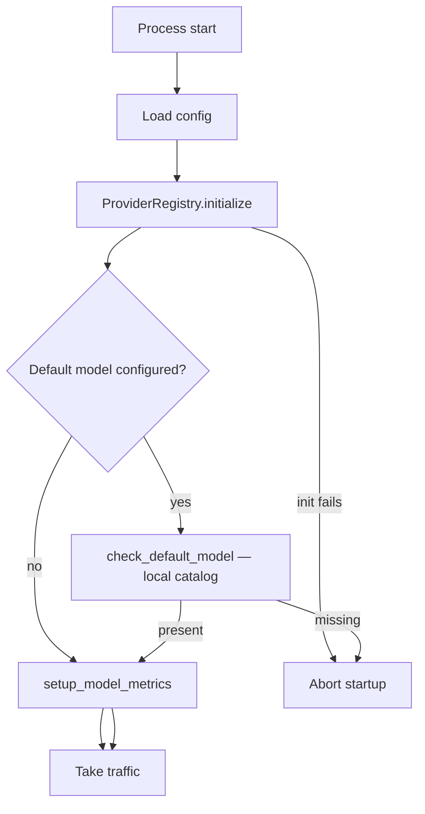

# PAI migration — catalog and health endpoints

|                          |                                                                                   |
|--------------------------|-----------------------------------------------------------------------------------|
| **Date**                 | 2026-10-08                                                                        |
| **Component**            | lightspeed-stack                                                                  |
| **Authors**              | Andrej Šimurka                                                                    |
| **Feature / Initiative** | [UIESTRAT-216](https://redhat.atlassian.net/browse/UIESTRAT-216)                  |
| **Spike**                | [LCORE-4290](https://redhat.atlassian.net/browse/LCORE-4290)                      |
| **Links**                | Investigation: `docs/devel_doc/pai-catalog-health-endpoints.html`                 |

This document is the architecture for LCORE’s catalog and health endpoints after OGX removal. It records the chosen design and the reasoning behind it; it is not an implementation specification.

---

## 1. Overview

LCORE exposes catalog and health endpoints that tell callers which inference surfaces are available and whether the process can take traffic. Today those behaviors depend on OGX: `/v1/providers` proxies its plugin inventory, `/v1/tools` uses that inventory for file-search discovery, `/v1/info` reports an OGX version, and `v1/readiness` checks whether the sidecar is reachable and can serve the default model.

As part of the PAI migration, OGX is removed from the stack. Inference moves in-process, so there is no remote plugin list, backend version, or sidecar health surface for these endpoints to query.

PydanticAI (PAI) will replace OGX for vendor communication. It constructs models in-process through LCORE’s provider registry, but it does not provide catalog or probe HTTP APIs, and it has no equivalent of degraded mode.

LCORE will therefore own these surfaces directly. It removes the provider inventory, keeps tools, info, and liveness as LCORE-owned endpoints, and redefines readiness as a local check that the provider registry is initialized and the configured default model exists. Failures in vendors and optional services remain request-level errors rather than readiness or degraded-mode conditions.

This document defines that architecture. It describes how OGX supports these endpoints today, what changes with in-process PAI inference, and how each catalog and health surface is treated after OGX removal.

---

## 2. Background

This section establishes how OGX supports catalog and health endpoints today, what changes with in-process PAI inference, and which responsibilities remain with LCORE.

### 2.1 What OGX does today

OGX acts as a sidecar and exposes a remote inventory of plugins, including inference, MCP, and file-search APIs.

`GET /v1/providers` proxies `client.providers.list()`. Query, Responses, MCP, and RAG do not use this API. Its only internal consumers are the readiness health walk and file-search discovery for `/v1/tools` (`builtin_tools.py` / `get_file_search_tools`).

Readiness currently depends on OGX reachability. Startup attempts to connect to OGX; if that fails, `allow_degraded_mode` can activate `DegradedModeTracker` and allow traffic with `overall_status=degraded`. The readiness probe then lists OGX providers and checks default-model availability through `client.openai.list()`, with a library reload as a “self-heal” mechanism.

`GET /v1/info` calls `inspect.version()` to populate `ogx_version` and fails if OGX is unavailable.

OGX therefore owns four responsibilities on this path:

* **Provider inventory** — `providers.list()` behind `/v1/providers` and the readiness health walk.
* **File-search catalog entries** — discovered from the same plugin list for `/v1/tools`.
* **Backend version** — `ogx_version` on `/v1/info`.
* **Sidecar reachability** — connection and listing checks that determine whether the service is ready or degraded.

### 2.2 What PAI will do instead

PAI replaces OGX for vendor communication. LCORE constructs models in-process through its provider registry, so there is no sidecar plugin inventory or OGX health surface to query.

PAI does not provide `/v1/providers`, `/v1/tools`, `/v1/info`, or Kubernetes liveness and readiness probes. It also has no equivalent degraded mode. Default-model availability becomes a local registry concern rather than a remote plugin-health check.

### 2.3 Responsibilities After the Migration

**What PAI takes over.** In-process inference replaces OGX-backed vendor communication. Catalog and health endpoints no longer have an OGX process to proxy or monitor.

**Benefit of using PAI.** Removing the sidecar eliminates the need for degraded-mode handling, the `providers.list()` health walk, and `ogx_version`. Readiness can instead check local registry state.

**Gap LCORE must close.** With OGX removed, `/v1/providers` has no backend and should not be recreated as a multi-API inventory. `/v1/tools` must stop relying on OGX for file-search entries, `/v1/info` must not expose a misleading backend version, and readiness must reflect whether the process can serve inference from its local catalog—not whether a sidecar responds.

Existing LCORE product surfaces remain LCORE-owned: liveness, `/v1/models`, `/v1/mcp-servers`, MCP server listing, and the `/v1/tools` response shape for MCP and agent capabilities.

LCORE closes the gap by **removing `/v1/providers`**, serving tools and info from LCORE state, and redefining readiness as a **local registry and default-model check**, with degraded mode removed.

---

## 3. Final design at a glance

| Endpoint                        | Action                                                      |
| ------------------------------- | ----------------------------------------------------------- |
| `GET /v1/providers` (+ `/{id}`) | **Remove**                                                  |
| `GET /v1/tools`                 | **Keep** — MCP + capabilities; remove OGX dependency        |
| `GET /v1/info`                  | **Keep** — `name` + `service_version`; remove `ogx_version` |
| `GET /liveness`                 | **Unchanged**                                               |
| `GET /readiness`                | **Rewrite** — local `ProviderRegistry` + default model      |

The inference catalog remains `GET /v1/models`. MCP is not a `model-context-protocol` provider row, and file search is not an `inline::file-search` provider row.

The startup flow initializes the local provider registry, verifies the configured default model when one is set, and then configures model metrics. Registry initialization or default-model validation failures abort startup; no remote health checks or degraded-mode fallback are needed.

* **LCORE** owns these HTTP surfaces, local registry validation, and removal of degraded mode.
* **PAI** supplies in-process models through the registry; it is not a separate health backend.

---

## 4. Detailed design

### 4.1 Remove `GET /v1/providers`

No replacement. Inference identity is available through `provider_id` on `/v1/models`; MCP and file search belong to their respective LCORE surfaces, not provider inventory rows.

Remove the endpoint, related auth actions, response models, and tests. Do not rebuild a multi-API inventory.

### 4.2 Keep `GET /v1/tools`

Keep MCP and agent capabilities with the existing response shape. Remove OGX-backed file-search discovery; file-search catalog entries belong to the LCORE vector-store feature.

### 4.3 Keep `GET /v1/info`

Return `name` and `service_version` only. Remove `ogx_version` and regenerate OpenAPI. Do not substitute a PAI or library version.

### 4.4 Keep `GET /liveness` unchanged

Continue returning `alive: true`. Liveness checks whether the process is up; readiness determines whether it can serve inference.

### 4.5 Rewrite `GET /readiness`

**Remove OGX-dependent readiness and degraded mode.** Startup no longer connects to OGX, walks provider health, or reloads the library to recover default-model availability.

**Readiness means the local inference catalog is usable.**

* **Startup:** Load config, initialize `ProviderRegistry`, validate the configured default model if present, and configure model metrics. Fail startup if the registry or default model cannot be built.
* **Probe:** Check that the registry is initialized and the configured default model exists locally. No network calls.
* **Healthy:** HTTP 200, `ready: true`, `overall_status: healthy`, `providers: []`.
* **Unhealthy:** HTTP 503, `ready: false`, `overall_status: unhealthy`; identify the failing default inference provider when applicable.
* **No default model configured:** The default-model check passes.

Keep the existing response shape (`ready`, `reason`, `overall_status`, `impacts`, `providers`), but remove `HealthStatus.DEGRADED`.

Vendor reachability, MCP, vector stores, file search, and the optional conversation database are not readiness checks. Their failures remain request-level errors and do not make the pod unready.

Delete the sidecar-era degraded-mode machinery: `degraded_mode.py`, `allow_degraded_mode`, `ls_started_in_degraded_mode`, the metric, startup branch, readiness early return, and related documentation.

### 4.6 Alternative designs

* **Rebuild `/v1/providers`:** Duplicates `/v1/models` and invents inventory rows for MCP and file search.
* **Keep degraded mode for vendor outages:** Conflates sidecar availability with request-level inference failures.
* **Ping vendors or optional services from readiness:** Adds network dependency and couples traffic admission to unrelated subsystems.
* **Keep `ogx_version` as a PAI version:** Misrepresents LCORE service information; `service_version` is sufficient.
