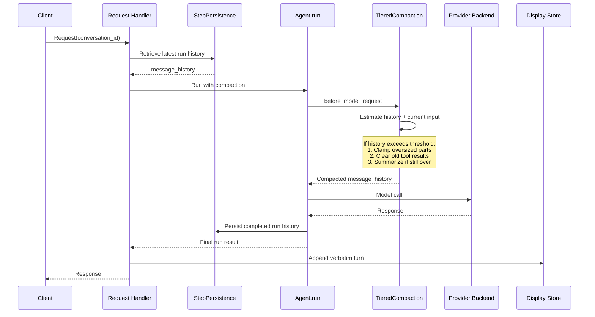

# PAI migration — conversation compaction

|                          |                                                                                   |
|--------------------------|-----------------------------------------------------------------------------------|
| **Date**                 | 2026-10-07                                                                        |
| **Component**            | lightspeed-stack                                                                  |
| **Authors**              | Andrej Šimurka                                                                    |
| **Feature / Initiative** | [UIESTRAT-216](https://redhat.atlassian.net/browse/UIESTRAT-216)                  |
| **Spike**                | [LCORE-4290](https://redhat.atlassian.net/browse/LCORE-4290)                      |
| **Links**                | Investigation: `docs/devel_doc/pai-compaction-migration.html`                     |

This document is the architecture for LCORE’s conversation compaction after OGX removal. It records the chosen design and the reasoning behind it; it is not an implementation specification.

---

## 1. Overview

Long-running conversations can exceed the model’s context window. LCORE’s compaction infrastructure automatically reduces the history sent to the model, preserving the most relevant context so the conversation can continue within the available context window. At the same time, LCORE maintains the complete, verbatim conversation for display to the user, ensuring that compaction does not prevent users from viewing the full transcript.

Today, compaction is coupled to OGX. LCORE stores compacted summaries separately in local storage, while OGX stores the verbatim conversation turns. When compaction is active, LCORE reconstructs the inference context from summaries, recent verbatim turns, and the current query, instead of passing conversation id to OGX, preventing OGX from loading the full conversation history.

After OGX removal, the conversation has two representations sharing one conversation id: LCORE’s display store retains the verbatim transcript, while PAI persistence stores the agent history used for subsequent inference. The PAI harness provides the compaction mechanism; LCORE owns the display conversation and compaction policy. Compaction operates on agent history without rewriting the display transcript or requiring LCORE to reconstruct model input.

This document describes the current implementation, evaluates design options, and defines the selected architecture for compaction, agent history, and display history.

---

## 2. Background

This section establishes the baseline for the migration. It describes how LCORE compacts conversations today, what PAI and the harness provide instead, where their capabilities differ from LCORE's current behavior, and what LCORE needs to retain or reimplement as part of the migration.

### 2.1 What LCORE does today

Today, conversation persistence is split across several stores: the OGX conversation store, the LCORE conversation cache (a variant of that store), the LCORE conversation envelope (topic summary and related metadata), and LCORE compaction storage. When the compaction flow is used, compacted turns are stored in LCORE and supplied from there to build the inference context.

The current product behavior is based on the original compaction design:

- **Additive summaries** — older parts of the conversation are summarized into separate summaries that are retained. A recursive fold is used only when the accumulated summaries themselves become too large.
- **Same model** — the model used for summarization is the same model selected for the user query.
- **Recent verbatim buffer** — LCORE retains a recent buffer of `buffer_turns` user/assistant pairs. The buffer is reduced until it fits within `buffer_max_ratio` of the available context.
- **Configurable policy** — YAML `CompactionConfiguration` controls whether compaction is enabled and defines its main thresholds, including `threshold_ratio`, `token_floor`, `buffer_turns`, and `buffer_max_ratio`.

The current implementation also has to work around the fact that OGX owns the conversation context used for inference. Once a conversation has been compacted, LCORE cannot simply pass the conversation back to OGX because OGX would reload the full conversation and effectively undo the compaction.

Instead, LCORE builds the inference input explicitly from the summaries, recent conversation items, and the current query, while preventing OGX from restoring the original conversation. It also uses internal marker messages to represent summaries and, for some flows, persists summary state separately so that subsequent requests can reconstruct the compacted context. The original user input is then added back to the OGX conversation after the request so that the user-facing transcript remains complete.

Compaction is triggered using an estimate of the context required for the current request. The estimate includes instructions, summaries, recent items, and the current query. The configured context window comes from `inference.context_windows`. Token usage is estimated from message text, while tool items are not included in the estimate. Each compacting request recalculates the estimate from the conversation rather than maintaining a persistent token-usage counter.

The behavior exposed by the existing APIs is:

| Surface | Behavior |
|---|---|
| `/v1/query` | Blocking compaction; `context_status` is included in the response |
| `/v1/streaming_query` | SSE `compaction` / `started` event before summarization; `context_status` on `end` |
| `/v1/responses` | Silent compaction when enabled and a conversation is present without `previous_response_id` |
| A2A | Blocking compaction without summary caching or folding |

A per-conversation lock prevents concurrent evaluation and summarization from modifying the same compacted state. Images are currently rejected in compacted mode, and internal compaction markers are filtered from conversation responses.

### 2.2 What PAI will do instead

PAI is the library LCORE will use to run the agent loop. The agent maintains its inference context as a `message_history` containing PAI `ModelRequest` and `ModelResponse` objects.

The PAI harness can persist this agent history between runs through `StepPersistence`. Continuing a conversation loads the latest persisted state, while branching from an earlier point can create a new run from that state.

PAI capabilities can rewrite that history in place — either once per user turn via `wrap_run`, or on every model call via `before_model_request` (including after tools). That is the natural place to compact: shrink `message_history` before it is sent to the model, without changing the conversation stored for display.

The harness already provides a `TieredCompaction` strategy for this purpose. It applies a sequence of increasingly expensive reductions and measures the result after each step, stopping once the history fits the configured target. The strategy starts with inexpensive reductions such as limiting oversized content and removing older tool results, and only uses summarization when those reductions are insufficient.

The harness also provides token-usage tracking based on model responses and supports a local token estimator for newer content. For models whose context window cannot be inferred automatically, LCORE must provide the appropriate context-window configuration or reasonable default value.

### 2.3 Responsibilities After the Migration

**What PAI takes over.** Agent-facing history becomes PAI's responsibility. PAI and the harness manage the history used by the agent, determine when it needs to be reduced, apply the compaction strategy, and persist the resulting history so that subsequent runs can continue from the compacted state. Summarization continues to use the same chat model as the user query.

**Benefit of using the harness.** The tiered strategy extends LCORE's current LLM-based summarization with inexpensive reduction steps, such as limiting oversized content and removing older tool results, before summarization is needed. Also, once a conversation is compacted, the compacted history is persisted and automatically used by every subsequent agent run.

**Gap LCORE must close.** PAI does not own LCORE's user-facing conversation or compaction policy. LCORE must continue to maintain the conversation state, configure the harness, provide context-window information, and preserve the existing API behavior around compaction.

The migration also removes the OGX-specific machinery that exists only because OGX currently owns inference context. This includes reconstructing context from stored items, inserting compaction markers, using `omit_conversation`, and treating the summary cache as the source of the agent's compacted state.

LCORE will close this gap by attaching **harness `TieredCompaction`** to the PAI agent run and treating the two histories as independent: compaction only rewrites the agent context, while the display history remains complete and continues to record the conversation exactly as it was spoken.

---

## 3. Final design at a glance

The design has two parts. At request time, LCORE loads the latest agent snapshot for the `conversation_id` (or forks from an earlier run on the [Responses API](pai-responses-lcore-rewrite.md#46-conversation-and-response-continuation)) and starts `Agent.run` with `TieredCompaction` attached. If the upcoming request is over the threshold, the capability shrinks older context before the model call. After the run, `StepPersistence` snapshots the rewritten history, and LCORE appends the verbatim turn to its own display store.

The runtime relationship is one conversation identity and two stores: `conversation_id → display transcript` and `conversation_id → agent snapshot`. Compaction never copies the display store into the model prompt, and it never rewrites the display store to match the shrunk agent list.

### Two stores

The display store is used only so clients can list, get, and show the full conversation thread. After each run LCORE maps the agent result into this format and **appends the turn as spoken**. Compaction does not rewrite it.

The agent context is used only to prompt the next `Agent.run`. Continue loads the latest snapshot; a branch from an older turn uses `fork_run` plus new LCORE ids. This list is what compaction shrinks. The next continue already sees the shrunk snapshot.

### Request flow

A typical continue first retrieves the latest run history, then starts the agent run. Compaction is a capability on that run. It estimates the history plus the current input against the model window. If the history exceeds the threshold, it applies the cheap reduction steps first and summarizes only if the history is still too large. The completed run history is then persisted, and the agent returns the final run result to the handler. Display storage is updated separately with the verbatim turn.



The persisted run history is the source of truth for the next agent run. The display store is the source of truth for display. They represent the same conversation in different forms.

- **LCORE** owns the display store, conversation ids, `CompactionConfiguration`, context windows, tokenizer wiring, optional Red Hat prompt, and product surfaces (`context_status`, streaming `compaction` events).
- **PAI / harness** owns `message_history`, StepPersistence, token estimation against the window, and the shrink ladder.

---

## 4. Detailed design

### 4.1 Two stores, one conversation ID

OGX-era compaction had to fight the store it compacted. OGX conversation items were both the UI transcript and the inference context. Once a summary existed, LCORE had to hide the full list from OGX (`omit_conversation`) and reconstruct model input itself, while still writing markers and original turns back into the same item list so the UI did not lose history.

PAI-era conversations split those roles. The [Conversations API](pai-conversations-api-redesign.md#41-two-stores-one-conversation_id) redesign already assumes this split; compaction does not invent a third store.

| Store | Format | Reader | Compaction |
|---|---|---|---|
| Display | LCORE SQL conversation (`items[]`) | `/v3/conversations` | Never rewritten. Each turn is appended as spoken. |
| Agent context | PAI `message_history` | Next `Agent.run` | Rewritten in place when over threshold. Next continue loads the shrunk snapshot. |

A new conversation starts with no persisted agent history. A continue loads the latest persisted run history. A fork loads the history from a chosen earlier point and uses it to start a new conversation. A linear continue therefore always builds on the latest persisted run history rather than reconstructing the conversation by combining earlier runs.

This keeps persistence separate from compaction. `StepPersistence` is responsible for storing and retrieving the agent history, while the compaction strategy is responsible only for reducing that history when needed. No separate summary cache or compaction markers are required for the agent to continue from the compacted history.

### 4.2 When compaction runs

Compaction is evaluated before each model call, using the history that the agent is about to send together with the current input.

The decision is based on the estimated size of that request relative to the model’s context window:

- **Threshold** — compact when estimated tokens reach `threshold_ratio × context_window`.
- **Context window** — taken from optional `metadata.context_window` on the model’s `allowed_models` entry in the provider registry, otherwise from automatic resolution when available. If no context window is available, compaction uses a reasonable default value.
- **Token estimate** — use the token usage from the latest model response as the baseline. Its input and output token counts represent the provider-reported usage for the previous model call. Content added since that response is then estimated locally using LCORE's existing `tiktoken` tokenizer. This avoids re-tokenizing the entire history on every compaction check while still accounting for new content.

Any implementation then runs the same stages:

1. **Load agent history** — the message list the next model call would see.
2. **Estimate** — that list plus the new user input (and instructions / tools if the estimator includes them). If under the threshold, skip rewrite.
3. **Shrink** — only if over threshold. Reduce older context while preserving enough structure that the provider still accepts the list (especially tool-call / tool-return pairing).
4. **Write back, then run** — the rewritten list becomes the run’s live history. The model loop appends this turn. Agent storage snapshots that list. Display storage appends the verbatim turn.

Harness `TieredCompaction` performs estimate and shrink on `before_model_request`, so it can run again mid tool-loop if a later model call is still over the window. That is a deliberate difference from today’s once-per-user-turn apply.

### 4.3 Shrink strategy: tiered compaction

LCORE will use `TieredCompaction` with three tiers in a fixed order: **clamp**, then **clear tool results**, then **summarize**. The order is intentional because each tier addresses a different type of oversized content:

* **Clamp oversized content** — rewrites oversized assistant text or tool-call arguments. Tool returns are outside its scope.
* **Clear old tool returns** — removes older tool results to reclaim context space. This cannot reduce an oversized assistant response or tool-call argument.
* **Summarize** — summarizes the remaining history when the cheaper reductions are not enough. This is the final step because it requires an additional LLM call and may still hit the same context limit if a single item is already too large.

The strategy re-checks the history after each step and stops as soon as it fits the target. This means later steps are not necessarily applied—for example, if clearing old tool returns is enough, an oversized assistant part may remain untouched.

The summarize call uses the same chat model as the user query. An optional Red Hat `summary_prompt` can replace the harness default; it must contain `{messages}` placeholder. Persistence and the display split are unchanged by which tier actually ran.

A conceptual composition of the ladder:

```python
compaction = TieredCompaction(
    tiers=[
        ClampOversizedMessages(...),
        ClearToolResults(...),
        SummarizingCompaction(
            incremental=True,
            preserve_first_user_message=True,
            keep_user_messages=True,
            ...
        ),
    ],
    target_fraction=threshold_ratio,
    context_window=window,
    tokenizer=estimate_tokens,
)

agent = Agent(chat_model, capabilities=[compaction, ...])
```

Using `SummarizingCompaction` alone would add an LLM call even when the context could be brought back under the limit through cheaper reductions. LCORE will therefore use the tiered strategy so that oversized tool-heavy histories are first reduced through non-LLM steps, with summarization used only when those reductions are insufficient.

### 4.4 Configuration

LCORE keeps a compaction configuration block. Operators still enable the feature and set a threshold against the context window. Per-model window overrides move under `allowed_models[].metadata` rather than a separate map. The knobs do not map 1:1 onto harness names, and some units change.

```yaml
compaction:
  enabled: true
  threshold_ratio: 0.7
  buffer_turns: 4
  buffer_max_ratio: 0.3

inference:
  providers:
    - type: vllm
      id: rhaiis
      allowed_models:
        - name: granite-3.3-8b-instruct
          provider_model_id: granite-3.3-8b-instruct
          metadata:
            context_window: 128000  # optional; when auto-resolution is unavailable
      config:
        base_url: ${env.RHAIIS_BASE_URL}
```

| LCORE today | After PAI cutover |
|---|---|
| `enabled` | Attach or omit the capability |
| `threshold_ratio` | `target_fraction` |
| `token_floor` | **Dropped** — harness has no equivalent; on modern context windows the ratio gate already dominates |
| `buffer_turns` / `buffer_max_ratio` | `keep_messages` / `keep_tokens` — different unit (messages or tokens, not turn pairs) |
| `inference.context_windows` | **Moved** — optional `allowed_models[].metadata.context_window`; supplied to harness as `context_window` when set |
| tiktoken `cl100k_base` | `tokenizer=estimate_tokens` |

`token_floor` is removed from the PAI-era configuration. Compaction triggers only on `target_fraction` (mapped from `threshold_ratio`) against the context window. The top-level `inference.context_windows` map is also removed; set `metadata.context_window` on the relevant `allowed_models` entry instead (see the [provider registry](pai-providers-registry.md#45-get-v1models)).

`buffer_turns` is not `keep_messages`. A turn pair in today’s engine is a user/assistant exchange; a harness message is a PAI `ModelRequest` or `ModelResponse`, and a tool loop can add several of those inside one user turn. Operators who tuned the verbatim buffer against turn pairs should not expect the same numeric value to preserve the same amount of recent chat.

When compaction is disabled, the capability is omitted and requests that overflow the window fail as they do today (HTTP 413).

### 4.5 Request surfaces

All request surfaces use the same PAI agent run and compaction capability. Compaction is therefore no longer implemented separately for each endpoint or by rewriting OGX conversation items.

Existing product behavior is preserved where required: streaming can continue to expose compaction events, `context_status` remains available where currently exposed, and `/v1/responses` remains silent about compaction.

The OGX-specific handling of compaction markers, including filtering them from conversation responses, is removed. Compacted history is no longer represented in the display store, so `/v3/conversations` continues to return the complete verbatim conversation and does not perform any compaction itself.

### 4.6 Alternative design

An alternative would be to carry LCORE’s current additive compaction engine forward as a custom PAI compaction capability. This would preserve the existing additive summaries, partitioning, folding, buffer policy, and `CompactionConfiguration` semantics, while adapting the implementation to PAI’s `ModelRequest` / `ModelResponse` history.

This would require implementing the compaction lifecycle around the PAI agent, including history partitioning, token estimation, summary generation, folding, and safe handling of PAI message parts. The existing OGX-specific request-path logic would still need to be removed, including compaction markers, `omit_conversation`, and pre-agent compaction. Support for tool-heavy histories and oversized individual parts would also need to be defined and implemented as part of the custom capability.

The design is technically viable and would provide closer continuity with today’s compaction behavior, particularly the additive summary model. However, it would leave LCORE responsible for maintaining and extending a substantial custom compaction implementation. It also **does not provide the cheaper reduction steps offered by the harness, such as clamping oversized content and clearing old tool results**, so those would need to be added separately if desired.

### 4.7 What is removed

After the PAI cutover, the OGX-coupled compaction machinery described in [§2.1](#21-what-lcore-does-today) is removed from the request path. With the harness strategy chosen, this includes:

* Fetching OGX conversation items to construct compacted inference context
* Compaction marker writes such as `[lightspeed:compaction-summary]` and `[covers:N]`
* `omit_conversation` on `ResponsesApiParams`
* `apply_compaction` as a pre-agent rewrite of request parameters
* LCORE persistence of compacted turns (`ConversationSummary` rows)

The display conversation remains unchanged and continues to store the complete verbatim history. Existing configuration and API surfaces such as compaction settings, query SSE events, and `context_status` can remain where they are still meaningful.
