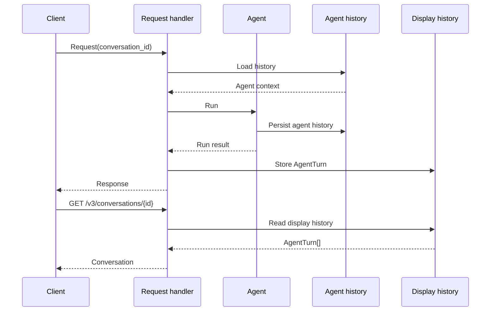

# PAI migration — conversations API

|                          |                                                                                   |
|--------------------------|-----------------------------------------------------------------------------------|
| **Date**                 | 2026-10-09                                                                        |
| **Component**            | lightspeed-stack                                                                  |
| **Authors**              | Andrej Šimurka                                                                    |
| **Feature / Initiative** | [UIESTRAT-216](https://redhat.atlassian.net/browse/UIESTRAT-216)                  |
| **Spike**                | [LCORE-4290](https://redhat.atlassian.net/browse/LCORE-4290)                      |
| **Links**                | Investigation: `docs/devel_doc/pai-conversations-api-redesign.html`               |

This document is the architecture for LCORE’s Conversations API after OGX removal. It records the chosen design and the reasoning behind it; it is not an implementation specification.

---

## 1. Overview

Clients use LCORE’s Conversations APIs to view and manage conversation history. Today the same representation is both the history shown to the user and the context supplied to the next model run. `/v1/conversations` reads that history from OGX conversation items; `/v2/conversations` is a local cache of the same chat-era model.

As part of the PAI migration, OGX is removed from the stack entirely—it is not present in any deployment option. The same conversation then has two representations that share one conversation id: LCORE’s display store holds the verbatim transcript for clients, and PydanticAI (PAI) persistence holds the agent history used to continue a run.

PAI owns that agent history, including transforms such as compaction. It does not provide a client-facing conversation API. LCORE already has local persistence through `/v2`, but that API still follows the traditional QA and chat model and does not represent agentic turns well.

LCORE will therefore introduce a new Conversations API over a display store that is independent of agent history. Conversation reads use only the display history; continuing a conversation uses only the agent history.

This document defines that architecture. It describes how conversations work today, what PAI provides, and how the new Conversations API represents agentic turns after OGX removal.

---

## 2. Background

This section establishes the baseline. It describes how OGX handles conversations today, what PAI provides instead, where the two differ, and how LCORE closes the remaining gap.

### 2.1 What OGX does today

For `/v1/conversations`, LCORE constructs the conversation response by combining conversation items persisted by OGX with additional conversation metadata stored in LCORE, such as topic summary, timestamps, and the last-used model.

Those same conversation items also provide the inference context for the next turn. When a request continues a conversation, OGX loads the stored history and uses it as context for the next model run. Display history and agent context are therefore represented by the same underlying conversation data.

This coupling makes compaction difficult. When LCORE compacts a conversation and then continues it, OGX loads the full uncompacted history, which can exceed the model’s context window again. LCORE cannot rewrite the conversation items stored by OGX, so it must store compaction items locally and then manually combine them with latest verbatim turns from OGX when reconstructing model context. This adds complexity and work to the request path. Separating display history from agent history removes this constraint and allows the agent to use its compacted history directly.

### 2.2 What PAI will do instead

PAI will run the agent and own the history required to continue an agent run. Its message history represents the requests and responses exchanged with the model, including the different parts produced during an agent run.

This history can be persisted and restored so that an agent can continue or fork a run. It is designed for agent execution rather than as a client-facing conversation representation.

PAI stores agent runs in a format optimized for supplying the agent with the context it needs to continue execution, rather than for client-facing conversation CRUD operations.

### 2.3 Responsibilities After the Migration

**What PAI takes over.** Agent-facing history, including the context required to continue or fork an agent run. This history can be transformed or compacted when needed for model execution.

**Benefit of using PAI.** Inference context no longer depends on the conversation representation exposed to clients. LCORE can maintain a complete, verbatim display history while the agent continues from the history required by the model.

**Gap LCORE must close.** PAI history is designed for agent execution, not for presenting and managing conversations. LCORE therefore needs its own client-facing conversation representation. LCORE already has a local persistence layer through `/v2/conversations`, but it follows the traditional QA and chat model used by `/v1`. That model is increasingly inadequate for agentic interactions, where a turn can contain ordered multimodal inputs and outputs, tool calls, tool results, retrieval results, and other outcomes.

LCORE will address this gap by introducing a new version of the Conversations API with a new client-facing conversation model. Each agent run will be represented as an `AgentTurn` with typed input and output items that describe what started the run and what it produced. The same `conversation_id` identifies the corresponding agent history. Display history is not used to rebuild agent context, and agent history is not exposed directly as the Conversations API representation.

---

## 3. Final design at a glance

One identity, two representations. A request that continues a conversation loads the agent history, runs the agent, and records the result in the display history. Conversation reads use only the display history.

| Concern         | Representation           | Used for                                 |
| --------------- | ------------------------ | ---------------------------------------- |
| Display history | LCORE conversation store | List, get, update, and delete            |
| Agent history   | PAI message history      | Providing context for the next agent run |

The existing API versions serve different roles during the migration

| Surface             | Representation                         | Role                                                                          |
| ------------------- | -------------------------------------- | ----------------------------------------------------------------------------- |
| `/v1/conversations` | OGX items combined with LCORE metadata | Deprecated and removed with OGX                                               |
| `/v2/conversations` | LCORE conversation cache               | Bridge for existing clients                                                   |
| `/v3/conversations` | LCORE display history                  | Agentic conversation timeline using `AgentTurn` with `input[]` and `output[]` |

The same `conversation_id` connects the display history with the agent history, but neither representation is used as a substitute for the other.

---

## 4. Detailed design

### 4.1 Two stores, one `conversation_id`

A conversation has one identity, represented by `conversation_id`, but two independent representations. The **display history** is the client-facing, verbatim record of the complete conversation, containing all turns and their items with no compaction or transformation. It is stored in LCORE persistence and used by the Conversations API. The **agent history** contains the message history used to continue the agent run and may be transformed or compacted for model execution. It is stored in PAI's `StepPersistence` and owned by PAI.

### 4.2 Why `/v3`, not another `/v2` tweak

`/v1` and `/v2` are based on the same chat-era conversation model. A turn is primarily a user message and an assistant message, with tool calls and results represented separately. This model does not map well to agentic interactions.

| Gap                    | Why it matters                                                           |
| ---------------------- | ------------------------------------------------------------------------ |
| Chat turn model        | An agent run can contain multiple steps and outcomes                     |
| Separate tool arrays   | They cannot preserve the full order of messages, tool calls, and results |
| Text-oriented messages | Inputs and outputs can be multimodal                                     |

`/v3` therefore introduces a new conversation model based on typed turn items split into `input[]` and `output[]`. The breaking change is intentional. `messages`, `tool_calls`, and `tool_results` are replaced by that representation. Existing `/v2` clients remain on the chat-era model during migration, while `/v3` provides the model needed for agentic interactions.

### 4.3 Conversation envelope

The conversation envelope contains the conversation identity, conversation-level metadata, and an ordered `chat_history` of `AgentTurn` values. Metadata keeps the fields clients already rely on (`created_at`, `last_used_model`, `last_used_provider`, `topic_summary`), with `last_turn_at` replacing the older message-based timestamp and `turn_count` replacing `message_count`. List responses use the same envelope without `chat_history`. `available_quotas` remains part of live query and streaming responses rather than conversation history.

### 4.4 AgentTurn

Each element of `chat_history` represents **one agent run** (one PAI `Agent.run`, and the same identity as Responses `response.id` when that path created the turn). The public turn is not PAI `ModelRequest` / `ModelResponse` history; it is an LCORE projection of that run.

Turn fields:

| Field | Role |
| --- | --- |
| `id` | Run identity (`run_id`) |
| `status` | `completed`, `interrupted`, `failed`, or `awaiting_input` |
| `agent` | Optional agent identifier; reserved, may be null |
| `provider` / `model` | Inference selection used for the run |
| `started_at` / `completed_at` | Run lifecycle timestamps |
| `context_status` | Whether agent context for this run was `full` or `summarized` |
| `usage` | Aggregated token usage for the run |
| `referenced_documents` | Deduplicated citation set for the turn |
| `input` | Ordered items that started the run |
| `output` | Ordered items the run produced |

`status` describes run lifecycle only. There is no public `blocked` status. Because a turn is one run, deferred client tools and approval pauses end the current turn with `awaiting_input`; the client's tool result or approval continues as a **new** turn whose `input` carries that reply. In-loop tools remain inside the same turn's `output`. The display timeline is `input` followed by `output`.

### 4.5 TurnItem discriminated union

Turn content is a discriminated union on `kind`. Every item has an `id` and `kind`. Message content is multimodal. Tool activity uses generic `tool_call` / `tool_result` rather than per-family kinds; optional `toolset` metadata can identify MCP, file search, or skills. Clients should ignore unknown kinds and unknown fields.

| `kind` | Purpose | Typical placement |
| --- | --- | --- |
| `user_message` | User prompt | `input` |
| `assistant_message` | Assistant text or refusal | `output` |
| `tool_call` | Tool invocation | `output` |
| `tool_result` | Tool outcome | `output` when in-loop; `input` when resuming a deferred call |
| `sources` | Retrieval evidence (`origin`: `inline` or `tool`) | `output` |
| `reasoning` | Optional reasoning content | `output` |
| `error` | Failed run outcome after accept | `output` |
| `approval_request` / `approval_result` | Optional HITL kinds | request in `output`; result in next turn `input` |

`sources` is LCORE-only: chunks live on the item; turn-level `referenced_documents` is derived at persist time. Inline RAG uses `origin: inline` and is not synthesized as a fake tool call. Run-level failures use `error` with namespaced `code` and optional `details`; tool failures that do not end the run stay on `tool_result`. New interaction types are added as new kinds rather than by overloading `error`.

### 4.6 Shields

Shield refusals are a normal completed turn: stream the refusal as tokens, persist it as `assistant_message`, set `status: completed`, and return HTTP 2xx. The public conversation does not expose `blocked`, moderation categories, or shield identifiers. Those signals remain internal for metrics, telemetry, and private storage. Publicly, a refused turn is indistinguishable from any other short completed assistant answer.

### 4.7 Streaming: align, don’t fork

Existing SSE (`StreamEventPayload`, discriminator `event`) is largely sufficient. Conversation GET never stores those events verbatim.

| SSE `event` | Persisted as |
|---|---|
| `start` | Turn correlation (`conversation_id` / `request_id`) |
| `token` / `turn_complete` | `assistant_message` in `output` |
| `tool_call` / `tool_result` | Same-named items in `output` |
| `end` | Turn `usage` / `context_status`; citations become turn `referenced_documents` |
| `error` / `interrupted` | Transport vs turn `status` / optional `error` item |
| `compaction` | Lifecycle only (already on the wire) |

Longer term, `QueryResponse` should evolve toward the same `AgentTurn` shape so sync query, stream reduction, and GET conversation share one schema.

### 4.8 Version rollout

1. Remove `/v1` with OGX gone.
2. Keep `/v2` stable for local-DB consumers (additive fixes only).
3. Implement the unified display store and persist path from agent runs.
4. Ship `/v3/conversations` with the `AgentTurn` `input` / `output` contract.

### 4.9 Alternative designs

**Expose PAI / harness conversation store as `/v3`.** That would couple the public API to PAI message parts and drop LCORE fields (inline `sources`, citations, topic summary). Clients would see inference format, including compacted history.

**Reimplement `/v1` on the local store.** That keeps the chat-era turn and blurs the variant story with `/v2`. The agentic break belongs on `/v3`.

**Rebuild agent context from the display store.** That reintroduces the OGX-era coupling compaction had to fight. PAI snapshots are the source for the next run.

**Treat deferred approval as one user turn spanning multiple runs.** That matches some UI kits, but conflicts with Responses / PAI run identity (`response.id` / `run_id`) and with LCORE's deferred continuation as a new run. `/v3` keeps turn = run; clients may group consecutive turns for display if needed.

### 4.10 What is removed

After the PAI cutover, the OGX-coupled conversation machinery in [§2.1](#21-what-ogx-does-today) leaves the request path:

* `/v1/conversations` backed by OGX conversation items
* Using OGX items as both display transcript and inference context
* Forwarding `conversation` / `previous_response_id` so OGX reloads full history

`/v2` remains until clients migrate. The display store, topic summary, RBAC, and Conversations CRUD remain LCORE. The public v3 turn no longer includes `messages`, `tool_calls`, `tool_results`, or a `blocked` status.
