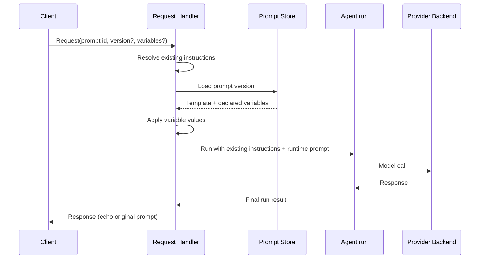
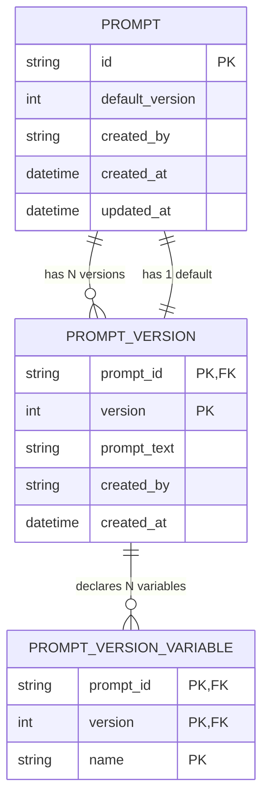
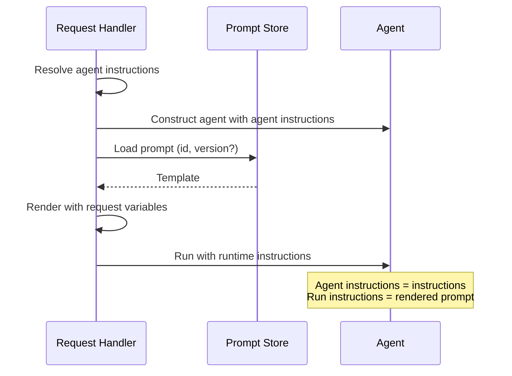

# PAI migration — prompts API

|                          |                                                                                   |
|--------------------------|-----------------------------------------------------------------------------------|
| **Date**                 | 2026-10-07                                                                        |
| **Component**            | lightspeed-stack                                                                  |
| **Authors**              | Andrej Šimurka                                                                    |
| **Feature / Initiative** | [UIESTRAT-216](https://redhat.atlassian.net/browse/UIESTRAT-216)                  |
| **Spike**                | [LCORE-4290](https://redhat.atlassian.net/browse/LCORE-4290)                      |
| **Links**                | Investigation: `docs/devel_doc/pai-prompts-api-migration.html`                    |

This document is the architecture for LCORE’s OpenAI-compatible Prompts API after OGX removal. It records the chosen design and the reasoning behind it; it is not an implementation specification.

---

## 1. Overview

A **prompt** is a stored, versioned system-instruction template. Clients manage prompts through `/v1/prompts` and reference them from `/v1/responses` using a prompt identifier, an optional version, and optional substitution values:

```json
{
  "prompt": {
    "id": "pmpt_…",
    "version": "1",
    "variables": {
      "role": "Kubernetes expert",
      "topic": "OpenShift"
    }
  }
}
```

Unlike inline `instructions`, which apply to a single request, a stored prompt can be reused across requests and rendered with different values. It is also separate from LCORE's user **saved prompts**, which are personal snippets rather than the shared OpenAI-compatible prompt catalog.

Today, OGX owns this catalog. LCORE's `/v1/prompts` endpoints delegate prompt management to OGX, and the responses path can rely on OGX to resolve a referenced prompt during inference. With OGX being removed, LCORE needs to take ownership of this application-level capability.

PAI provides the mechanism for applying instructions to an agent run, but it does not provide a prompt catalog. It does not store or version templates, validate their variables, or resolve prompt identifiers.

LCORE will therefore introduce a **local versioned prompt store**. When a request references a prompt, LCORE resolves the requested version, renders the template with the supplied variables, and passes the resulting text to the PAI agent as **runtime instructions**. LCORE's existing `instructions` behavior remains unchanged.

The public API remains unchanged: clients continue to manage prompts through `/v1/prompts` and reference them through `responses.prompt`. The migration changes **who owns prompt storage and resolution**, not how clients use the API.

This document describes the resulting prompt resource, local store, rendering and validation rules, and how a stored prompt becomes part of a PAI agent run.

---

## 2. Background

This section establishes the baseline. It describes how OGX handles stored prompts today, what PAI provides instead, where the two differ, and how LCORE closes the remaining gap.

### 2.1 What OGX does today

OGX is LCORE’s prompt catalog. `/v1/prompts` is a thin pass-through: create, list, get, update, and delete operations are delegated to OGX. OGX assigns prompt identifiers, maintains immutable versions, tracks the default version, validates template variables, and stores the prompt content.

On `/v1/responses`, a client may provide either inline `instructions` or a `prompt` reference. Inline instructions are already resolved by LCORE from the request, profile, or deployment configuration. A stored prompt, by contrast, is processed by OGX during the inference request: LCORE forwards the prompt reference to OGX, which loads the requested version, applies the provided variable values to the template, and returns the resulting instruction text.

The following summarizes the responsibilities OGX currently owns:

* **Prompt identity** — identifiers in the OpenAI-compatible `pmpt_…` form.
* **Versioning** — immutable revisions; updates create new versions.
* **Default version** — the version used when `version` is omitted.
* **Template validation** — Mustache-style `{{placeholders}}` must be declared.
* **Storage** — templates and their declared variables.
* **Request-time rendering** — loading the requested prompt version and applying the provided variable values to produce the instruction text.

LCORE already has a separate instruction path for `instructions`. That behavior remains unchanged. The gap is the stored, reusable prompt catalog currently provided by OGX.

### 2.2 What PAI provides instead

PAI is the library LCORE will use to run the agent. It can apply system instructions to an agent and supports per-run instructions through the `instructions` parameter.

A stored prompt is a per-request template. Once rendered, its result is passed to the agent as **runtime instructions** for that request.

PAI does not provide a prompt catalog: it does not store or version templates, validate their variables, or resolve prompt identifiers.

### 2.3 Responsibilities After the Migration

**What PAI takes over.** Applying the rendered instruction text to the agent run. Once LCORE has rendered a stored prompt, PAI carries that text into the model call through its runtime `instructions` path.

**What LCORE takes over.** LCORE becomes responsible for the prompt catalog that OGX previously provided: storage, versioning, validation, rendering, and API compatibility.

**Result.** LCORE introduces a **local prompt store** that records versioned templates, renders a referenced prompt at request time, and passes the result to PAI as runtime instructions. The client-facing `prompt` object remains part of the API, while the prompt identifier is not forwarded to the model backend.

---

## 3. Final design at a glance

The design has two parts. Clients continue to manage prompts through `/v1/prompts`. At request time, LCORE loads the referenced prompt version from the local store, applies the provided variables, and passes the resulting text to the agent as runtime instructions. The existing `instructions` behavior remains unchanged.

The prompt store contains prompt identities, their immutable versions, and a default version for each prompt. Rendering does not modify stored versions.

### Request flow

A responses request that references a prompt loads the requested version, applies the supplied variables, and runs the agent with the rendered prompt as runtime instructions. The existing LCORE system instructions remain in place, and the original `prompt` object is echoed in the HTTP response without being sent to the model backend.



* **LCORE** owns the Prompts API, local store, template validation and rendering, and combining the existing system instructions with the rendered prompt.
* **PAI** applies the resulting instruction text during the agent run. It does not resolve prompt identifiers.

---

### 4.1 Prompt resource

A prompt is a reusable system-instruction template. When referenced by a request, LCORE renders it and passes the resulting text to the PAI agent as **runtime instructions for that run**.

Existing LCORE system instructions continue to be configured on the agent as its default `instructions`.

The resource exposed by `/v1/prompts` is:

| Attribute    | Meaning                                                |
| ------------ | ------------------------------------------------------ |
| `prompt_id`  | Stable identifier for the template                     |
| `version`    | Immutable revision number, starting at 1               |
| `is_default` | Whether this version is used when `version` is omitted |
| `prompt`     | Template text, which may contain `{{placeholders}}`    |
| `variables`  | Declared placeholder names for that version            |

A responses request refers to the stored resource rather than sending the full template:

```json
{
  "input": "How do I scale a deployment?",
  "prompt": {
    "id": "pmpt_…",
    "version": "1",
    "variables": {
      "role": "Kubernetes expert",
      "topic": "OpenShift"
    }
  }
}
```

Substitution values support strings and Responses content objects. **The initial LCORE implementation supports text values only.**

Stored prompts are **not** an output contract. They do not map to PAI `output_type` or `PromptedOutput`; those shape the model's return value, while stored prompts provide system instructions.

They are also separate from LCORE **saved prompts**. Saved prompts are user-owned snippets under `/v1/saved-prompts`. The Prompts API provides the shared, OpenAI-compatible catalog referenced through `responses.prompt`.

## 4.2 Local versioned store

OGX currently owns prompt persistence. After the migration, LCORE stores the prompt catalog locally.

The store has three conceptual parts:

- **Identity** — the prompt ID, ownership metadata, and default version.
- **Versions** — immutable revisions of the template text. An update creates a new version rather than changing an existing one.
- **Declared variables** — the placeholder names associated with each version.



`is_default` is derived from the prompt's default-version pointer rather than stored independently on each version. Clients still see `is_default` in the API resource.

When a request omits `version`, LCORE uses the prompt's default version. When a version is specified, LCORE uses that exact version. Prompt IDs or versions that do not exist result in a not-found error.

Updating a prompt creates a new immutable version. Existing versions remain available and can still be referenced explicitly.`

### 4.3 Template format and substitution

The Prompts API keeps the OpenAI-compatible Mustache-style format already used by OGX. Placeholders are `{{name}}` (optional spaces inside the braces). Names are simple identifiers. The format is not Jinja: there are no conditionals, filters, loops, or dotted paths.

Validation happens at two points:

- **Create and update** — every placeholder in the template text must appear in the declared `variables` list. Declared names that are not used in the text are allowed, so a template can reserve variables for later versions.
- **Request-time render** — the request must provide a value for every variable used by the selected version. Extra variables are rejected.

Valid templates include a prompt with no placeholders, a prompt whose declared list is a superset of the placeholders in the text, and ordinary `{{name}}` substitution.

Literal single braces in the text are not placeholders. Hyphenated or dotted names are not valid placeholder names. Empty prompt text is rejected.

rlsapi’s system prompt path uses Jinja2 separately. That format is not part of the Prompts API and remains out of scope here.

### 4.4 From request to agent

When a stored prompt is specified on a `/v1/responses` request, LCORE resolves it and passes the rendered prompt as **runtime instructions** for the individual agent run. `instructions` attribute provides the agent’s **static instructions**.

The two layers have distinct roles:

- **Agent instructions** — if the request includes `instructions`, use that value; otherwise fall back to LCORE’s profile, deployment, or built-in default. These are set when the agent is created.
- **Run instructions** — the rendered stored prompt. These are supplied to `agent.run()` for the individual request.

The steps are:

1. **Resolve agent instructions** — use the request’s `instructions` when present; otherwise fall back to the profile / deployment / built-in default.
2. **Load the prompt** — look up `id` and optional `version` in the local store.
3. **Render** — substitute the request’s variable values into the template.
4. **Run** — pass the rendered string as runtime instructions for this agent run.
5. **Respond** — echo the client’s original `prompt` object on the HTTP response. Do not send `prompt.id` on the model wire.



This split matters. Putting the rendered template only into the agent constructor would overwrite deployment defaults for that agent instance. Mapping it to PAI agent's `system_prompt` would reintroduce history and reinjection pitfalls that PAI’s `instructions` path avoids. Forwarding the prompt identifier after OGX removal would have nowhere to go.

A conceptual composition of the two layers:

```python
agent = build_agent(chat_model, resolved_instructions)  # from request.instructions or deployment default

rendered = prompt_store.render(
    prompt_id=request.prompt.id,
    version=request.prompt.version,
    variables=request.prompt.variables,
)

await agent.run(user_prompt, instructions=rendered)
```

If the request has no `prompt` field, the runtime layer is omitted and the agent runs with static insructions only.

### 4.5 Request surfaces

The public API remains OpenAI-compatible:

| Surface | Behavior |
|---|---|
| `POST /v1/prompts` | Create a template; version 1 becomes the default |
| `GET /v1/prompts` | List prompt identities |
| `GET /v1/prompts/{id}` | Return a version; default when `version` is omitted |
| `PUT /v1/prompts/{id}` | Create a new immutable version; optionally set it as default |
| `DELETE /v1/prompts/{id}` | Remove the prompt and its versions |
| `/v1/responses` `prompt` | Resolve, render, inject as runtime instructions; echo on the response |

Today only `/v1/responses` exposes the `prompt` attribute. If other agent entry points later accept a stored prompt reference, they should reuse the same store and the same load/render/inject helper rather than implementing rendering themselves.

Authorization for manage versus read on `/v1/prompts` is unchanged by the migration. Moving the catalog from OGX into LCORE changes where prompts are stored, not who may create, update, delete, list, or get them.

### 4.7 What is removed

After the PAI cutover, the OGX-coupled prompt machinery described in [§2.1](#21-what-ogx-does-today) is removed from the Prompts API and the responses path. With the local store chosen, this includes:

* Forwarding `/v1/prompts` CRUD to the OGX client
* Relying on OGX to validate placeholders at create and update
* Forwarding `responses.prompt` for server-side expansion
* Sending a prompt identifier on the model transport
