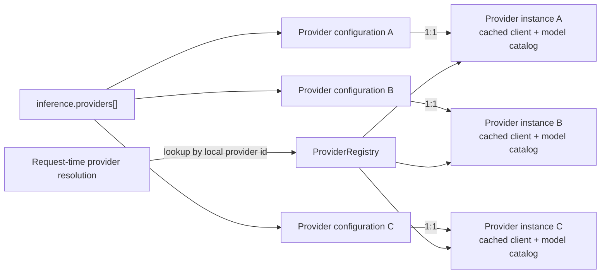
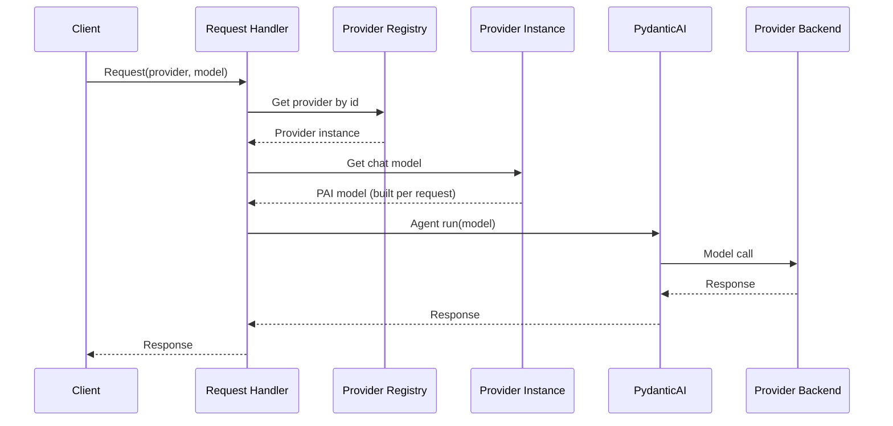
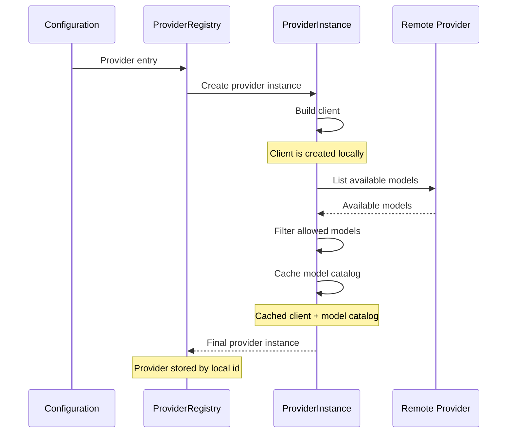
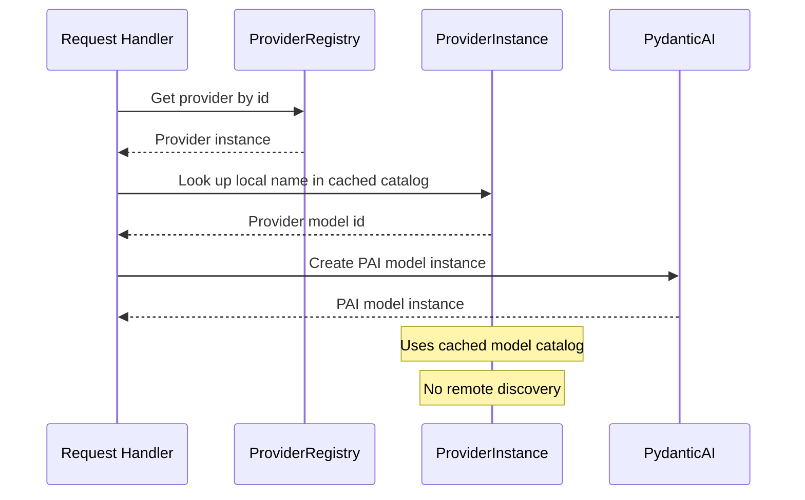

# PAI migration — provider registry

|                          |                                                                                   |
|--------------------------|-----------------------------------------------------------------------------------|
| **Date**                 | 2026-10-06                                                                        |
| **Component**            | lightspeed-stack                                                                  |
| **Authors**              | Andrej Šimurka                                                                    |
| **Feature / Initiative** | [UIESTRAT-216](https://redhat.atlassian.net/browse/UIESTRAT-216)                  |
| **Spike**                | [LCORE-4290](https://redhat.atlassian.net/browse/LCORE-4290)                      |
| **Links**                | Investigation: `docs/devel_doc/pai-providers-registry.html`                       |

This document is the architecture for LCORE’s inference provider registry after OGX removal. It distills design decisions from the PAI migration investigation; it is not an implementation specification.

---

## 1. Overview

When a user asks LCORE for an answer, they typically specify the provider and model they want to use. LCORE is responsible for resolving these request identifiers into the backend model that will serve the request. It first verifies that the requested provider is configured in the deployment and that the requested model is allowed for that provider. Once these checks pass, LCORE resolves the provider and model identifiers to the corresponding backend model instance and forwards the request to it.

Today, OGX performs that resolution. It owns which inference providers LCORE can use and which models are available through them. It maintains the configured providers, their **model catalogs**, and the integrations used to reach the underlying backends. As part of the PAI migration, OGX will no longer provide this application-level layer, so LCORE needs to take ownership of it.

PydanticAI (PAI) will replace OGX for vendor communication. It can construct chat and embedding calls against several backends, but it has no infrastructure for deployment policy, such as which providers are configured and which models operators have allowed for each provider.

LCORE will supply this infrastructure through a **provider registry**. The registry holds the inference providers available in a deployment and the models each provider is allowed to use (models catalog). When a request names a provider and model, the registry validates and resolves that pair to an allowed model, after which PAI handles the call to the corresponding backend.

This document defines the architecture of the provider registry. It describes how the LCORE inference configuration populates the registry, how the registry is structured at runtime, and how a request’s provider and model names are resolved to the corresponding backend model instance.

---

## 2. Background

This section establishes the baseline. It describes how OGX handles provider and model resolution today, what PAI provides instead, where the two differ, and how LCORE closes the remaining gap.

### 2.1 What OGX does today

Dispatching is one of OGX’s core capabilities. It resolves the provider and model specified in a request to the corresponding backend, forwards the request, and returns the result. LCORE exposes part of OGX’s model catalog through `GET /v1/models` and delegates inference and retrieval to OGX. After cutover, that catalog is served from this registry ([§4.5](#45-get-v1models)); the former `GET /v1/providers` inventory is removed (see [catalog and health](pai-catalog-health-endpoints.md#41-remove-get-v1providers)).

OGX’s model provider catalog is defined across three related configuration areas. `providers.inference` section defines the available inference backends, `registered_resources.models` registers the models exposed through those providers, and `allowed_models` can further restrict which models a provider is allowed to serve. The relationship between registered resources and the provider-level allow-list is not immediately clear from the configuration alone.

The following summarizes the responsibilities OGX owns across provider configuration, model registration, discovery, resolution, and inference routing.

- **Provider configuration** — inference backends declared in the OGX configuration (`run.yaml`) or synthesized from LCORE config.
- **Provider instantiation** — inference-provider plugins created from that configuration.
- **Provider/model association** — models registered against providers as `registered_resources`.
- **Model catalog** — the registered model list, with an optional provider-level allow-list acting as a gate over which models may be served.
- **Model discovery** — collecting models exposed by providers into the OGX catalog.
- **Selection and routing** — resolving a caller-supplied provider and model and forwarding the request to the corresponding backend.
- **Chat and embeddings** — invoking vendor backends through OGX inference providers.
- **Reranking** — typically configured as a raw Hub model identifier rather than as a first-class catalog resource.

### 2.2 What PAI will do instead

PAI is the library LCORE will use to talk to inference backends. It supplies provider implementations, the models those providers expose, and **model profiles** (configurations that define model-specific settings and capabilities).

PAI ships native integrations for OpenAI, Azure, Google Cloud (Vertex), Bedrock, and vLLM. Each integration knows how to reach its backend and how to construct a chat model and, where supported, an embedding model. LCORE call sites can use that common chat and embedding surface regardless of vendor. LCORE will have to implement a WatsonX provider on top of PAI’s chat model as it is not natively supported.

PAI gets provider connection settings either as constructor arguments or through environment variables. LCORE manages these settings in its deployment configuration and uses them to initialize PAI providers at startup. When a provider reads settings directly from environment variables, LCORE ensures the corresponding variables (e.g., API keys, project IDs, and locations) are set before initializing the provider.

A PAI **model profile** describes a chat model’s capabilities and supported request settings. This is particularly useful for the Responses endpoint, which exposes many request settings that not every model supports. LCORE can use the profile to drop or adjust unsupported or conflicting settings before sending the request, avoiding backend errors.

### 2.3 Responsibilities After the Migration

**What PAI takes over.** Vendor communication for chat and embeddings: constructing and invoking models through PAI’s provider and model infrastructure, including native OpenAI, Azure, Vertex, Bedrock, and vLLM integrations and a custom WatsonX provider on top of PAI’s chat model, and applying PAI model profiles.

**Benefit of using PAI.** LCORE no longer routes inference through OGX. PAI provides a common interface for chat and embedding models across backend providers, with model profiles defining their capabilities. LCORE also owns the provider registry directly, giving it explicit control over which providers and models are available.

**Gap LCORE must close.** PAI provides the backend integrations, but it does not manage the application-level model catalog. LCORE must therefore define which providers are configured, which models are allowed, and how user-facing provider and model IDs are resolved to backend models. LCORE also needs to cover capabilities that PAI does not provide directly, including reranking, the WatsonX integration and IAM binding, and profile information for models that PAI does not recognize. The resulting deployment catalog is owned by LCORE and exposes models under LCORE-defined names.

LCORE will close that gap with a **provider registry**: it records the configured providers and allowed models, resolves a caller-supplied pair, and delegates the vendor call to PAI.

---

## 3. Final design at a glance

The design has two main parts. At startup, LCORE creates one **final** runtime provider record in the provider registry for each inference.providers[] configuration entry. At request time, LCORE resolves the caller’s provider against the registry and then resolves the requested model against that provider’s catalog. PAI then performs the backend call. Sentence-transformers embeddings are handled by PAI’s local embedding model, with the model weights loaded locally rather than accessed over HTTP.

The runtime hierarchy has two levels: `provider → models`. By default, the configured `allowed_models` list acts as a filter on each provider’s discovered models. For providers that support model discovery, LCORE fetches the backend model list once at startup and retains only the models that pass the filter. A per-provider flag can instead treat `allowed_models` as the full catalog and skip that discovery step (see [§4.2](#42-registry-providers-and-model-catalogs)). The resulting model list is then fixed for the lifetime of the process.

### Provider registry



The registry stores providers and retrieves them by ID. It does not resolve models directly; model resolution is handled by the provider. Each provider is fixed for the lifetime of the process. During startup, remote providers either fetch their backend model list once and intersect it with the configured allow-list, or—with `skip_model_discovery`—build the catalog from `allowed_models` only. If no allow-list is configured on the discovery path, the full discovered model list is retained. The resulting catalog is cached, and models cannot be added later.

Sentence-transformers is an inline provider and does not expose a model-list endpoint. Its catalog is therefore defined entirely by the required model list in the configuration. The provider has no client; embeddings use PAI’s local sentence-transformers model, while reranking uses a local cross-encoder owned by LCORE. Remote chat and embedding models use PAI providers.

### Request flow

A typical chat request first looks up the provider in the registry and then asks that provider to resolve the requested chat model. Embedding and rerank requests follow the same two-step pattern using the corresponding model getter. An unknown provider or model name results in a not-found error.



The provider instance is created once and reused for the lifetime of the process. The PAI model instance, whether chat or embedding, is created per request. This is lightweight and allows per-request model settings to be applied.

LCORE owns the deployment configuration, provider registry, allowed-model catalog, model selection, WatsonX integration built on PAI’s chat model, and reranking.

PAI handles communication with remote backends and provides model profiles and the local sentence-transformers embedding model.

One provider registry covers chat, embedding, and rerank models. These capabilities are represented as model entries within a provider rather than separate registries. Chat model defaults never resolve to sentence-transformers.

---

## 4. Detailed design

### 4.1 Provider and model hierarchy in configuration

OGX and LCORE configurations both associate models with providers, but they express that relationship differently. OGX keeps provider configuration and model registration in separate parts of the configuration, while LCORE can make the provider-to-model relationship explicit within a single configuration tree.

#### OGX separates provider configuration from model registration

In OGX, inference providers are configured under `providers.inference[]`. A provider defines its backend, connection settings, and optionally an `allowed_models` list.

Separately, `registered_resources.models` contains model registrations. Each registration identifies the provider, the model exposed by the registry, and the provider-specific model identifier.

```yaml
providers:
  inference:
    - provider_id: openai
      provider_type: remote::openai
      config:
        api_key: ${env.OPENAI_API_KEY}
        allowed_models:
          - gpt-4o-mini

...

registered_resources:
  models:
    - model_id: gpt-4o-mini
      provider_id: openai
      model_type: llm
      provider_model_id: gpt-4o-mini
```

This creates an interpretation problem. At first glance, `registered_resources.models` looks like the model catalog, while `allowed_models` looks like another model list belonging to the provider. It is therefore not immediately obvious whether these represent two distinct concepts, whether one is a filter over the other, or how the two should be kept consistent.

#### LCORE keeps the relationship together

LCORE already simplifies this by keeping the provider and its `allowed models` in the same `inference.providers[]` entry:

```yaml
inference:
  providers:
    - type: openai
      id: openai
      allowed_models:
        - gpt-4o-mini
      config:
        api_key_env: OPENAI_API_KEY
```

The current limitation is that `allowed_models` is only a list of strings. It can define which backend models are allowed, but it cannot express a separate local model name or additional model metadata.

#### Proposed LCORE design

The proposed design makes each `allowed_models` entry a model catalog entry:

```yaml
inference:
  providers:
    - type: openai                  # provider kind (discriminator)
      id: openai                    # local provider id; default = type if omitted
      skip_model_discovery: false   # if true, skip startup list/filter; use allowed_models as catalog
      allowed_models:
        - gpt-4o-mini               # local catalog name == vendor id
        - name: fast-chat           # local catalog name
          provider_model_id: gpt-4o-mini
          model_type: llm           # will be inferred if not supplied
          metadata:
            context_window: 128000  # optional; when auto-resolution is unavailable
      config:
        api_key_env: OPENAI_API_KEY
```

The string form remains a shorthand where the local name is the same as the provider model ID. The structured form allows LCORE to define:

- `name` as the local LCORE model ID
- `provider_model_id` as the backend model ID
- `model_type` as the model capability, such as `llm`, `embedding`, or `rerank`
- `metadata` as an optional map of catalog metadata. `metadata.context_window` is the model’s context window in tokens; set it when the window cannot be resolved automatically (for example WatsonX or vLLM model ids). This replaces the separate `inference.context_windows` map.

`skip_model_discovery` is an optional provider flag. When true, LCORE skips the startup vendor list call and treats `allowed_models` as the full catalog (see below).

Provider `id` values must be unique across `inference.providers[]`. When `id` is omitted it defaults to `type`, so two entries of the same type — for example two vLLM deployments — must set distinct `id`s; otherwise configuration validation fails. Local model `name`s must likewise be unique within a provider’s catalog.

For example, a request using `model: fast-chat` can be resolved to the local catalog entry and then forwarded to the backend using `gpt-4o-mini`.

This makes the model catalog part of the provider configuration itself. LCORE does not need a separate `registered_resources.models` level to associate models with providers. `allowed_models` represents the provider's model catalog rather than another hierarchy level. For providers that support model discovery, it can act as a filter over the models returned by the backend. For providers such as sentence-transformers that do not expose model discovery, it defines the available model catalog directly.

Each provider entry may set `skip_model_discovery: true`. That opts out of startup model listing and of intersecting `allowed_models` with the backend inventory; the configured list becomes the catalog, and the deployer is responsible for listing only models that are actually available on that backend. This mode exists so curated or private deployments can boot without calling vendor list APIs and without LCORE second-guessing the manifest. It is intended for operators who already know which model IDs their endpoint serves (for example a fixed vLLM or RHOAI deployment) and who prefer explicit catalog entries—including `model_type` and `metadata.context_window` where needed—over discovery-derived typing.

When the flag is false or omitted, behavior stays as today: discover (where supported), then filter. When it is true, `allowed_models` must be non-empty; structured entries are encouraged to carry `model_type` (and `metadata` such as `context_window`) because startup no longer enriches the catalog from the vendor.

This gives LCORE a single, explicit relationship between providers and their models while still allowing local model IDs, backend model IDs, model capabilities, and optional per-model `metadata` (such as `context_window`) to be represented where needed.

### 4.2 Registry, providers, and model catalogs

The configuration in [§4.1](#41-provider-and-model-hierarchy-in-configuration) defines the provider and model catalog declaratively. At runtime, LCORE materializes that configuration into a single registry containing the live providers and their cached model catalogs.

#### Provider registry

The registry maps each local provider ID to one final runtime provider instance. For every inference.providers[] entry, it creates the provider, waits until it is ready, and stores it by ID.


The registry object is responsible for provider-level lookup. It maps a local provider ID to the corresponding fully initialized provider object. It does not own model resolution or model-specific state.

The provider object is responsible for model-level lookup. It owns the cached model catalog and resolves a local model name to the corresponding typed model object.

This keeps the object responsibilities aligned with the runtime hierarchy: the registry owns providers, and each provider owns its models.

#### Provider initialization and model catalogs

Each provider builds its backend client once and loads its model catalog during startup.

For remote chat and embedding providers, the default path queries the provider's model list or equivalent control-plane API and filters the result using `allowed_models`. If no allow-list is configured, the full discovered list is retained. Missing allowed models are omitted with a warning rather than causing startup to fail.

Sentence-transformers does not expose a remote model-list endpoint. Its required model list therefore defines the catalog directly, with no remote discovery step (equivalent to always using the configured-catalog path).

Each catalog entry is typed as `llm`, `embedding`, or `rerank`. Vendor metadata is used when available, with PAI known-name tables or model-name markers used as fallbacks.

The resulting catalog is cached for the lifetime of the process. Models cannot be registered later, and `GET /v1/models` reads this cache rather than performing model discovery on every request.

Each catalog entry contains a local name used by requests, a provider or Hub model ID used when communicating with the backend, a model type, and optional `metadata` from the `allowed_models` entry (including `context_window` when set).

#### Provider public interface

| Operation | Behavior |
|---|---|
| List models, optionally by type | Filters the cached catalog. If the provider has no models of the requested type, it returns an empty list. |
| Get chat, embedding, or rerank by local name | Returns the model when the local name exists in the catalog with the requested type. An unknown model or type mismatch results in not found. |
| Get chat profile | Returns the model profile after a successful chat model lookup. Embedding models do not use profiles. |

Chat profiles are assembled by merging the default profile with the provider's PAI profile when available, including family-aware handling for vLLM, or a conservative OpenAI-compatible base for WatsonX and otherwise unmapped model IDs. An optional `model_profiles_path` overlay can provide further customization. Unsupported request settings are dropped with warnings, while a 400 is returned only when the output contract cannot be started.

A single registry is sufficient because chat, embedding, and rerank are capabilities of catalog entries rather than separate control planes. All backends therefore expose the same provider interface instead of using separate capability-specific registries or mixins.

How requests use the cached catalog is described in [§4.4](#44-from-request-to-model).

### 4.3 Supported providers

LCORE owns provider configuration. For all supported backends except WatsonX, LCORE uses the corresponding native PAI provider, supplying the configured connection settings and required environment variables. WatsonX has no native PAI provider, so LCORE implements its integration on top of PAI model interfaces.

Seven provider types are supported. OGX-era `ollama`, `vllm_rhaiis`, and `vllm_rhel_ai` are removed; those product variants are represented by different IDs using the single `vllm` provider type.

The following sections describe each provider's configuration, authentication, model discovery, and supported model types.

#### OpenAI

OpenAI uses PAI's native `OpenAIProvider` with `OpenAIResponsesModel`. LCORE discovers models through the OpenAI-compatible `/models` endpoint.

Model type is inferred using PAI's `KnownModelName` and `KnownEmbeddingModelName` registries, with name-based markers used as a fallback.

Authentication is delegated to PAI through the configured API key. A custom `base_url` can be used for OpenAI-compatible endpoints. The same provider supports both chat and embedding models.

Example config section:

```yaml
config:
  api_key: ${env.OPENAI_API_KEY}
  # Optional for OpenAI-compatible endpoints.
  base_url: ${env.OPENAI_BASE_URL}
```

#### Azure

Azure uses PAI's native Azure provider and follows the same model discovery and catalog behavior as OpenAI. The main provider-specific concern is authentication.

LCORE supports both Azure API-key authentication and Microsoft Entra ID. For Entra ID, LCORE creates the Azure OpenAI client with an Azure Identity credential and passes it to PAI. **The Azure SDK handles token acquisition and refresh, removing the need for LCORE's existing Entra token-management lifecycle.**

The preferred Entra ID configuration is the nested `entra_id` section. The legacy `azure_entra_id` configuration remains supported for compatibility but is deprecated. When both are present, the nested `entra_id` configuration takes precedence.

Example config section:

```yaml
config:
  base_url: ${env.AZURE_OPENAI_BASE_URL}
  # api_key: ${env.AZURE_API_KEY}
  entra_id:
    tenant_id: ${env.AZURE_TENANT_ID}
    client_id: ${env.AZURE_CLIENT_ID}
    client_secret: ${env.AZURE_CLIENT_SECRET}
    # Optional.
    scope: ${env.AZURE_OPENAI_SCOPE}
```

LCORE passes the Azure Identity token provider directly to the Azure OpenAI client, allowing the Azure SDK to handle token acquisition and refresh.

```python
from azure.identity.aio import ClientSecretCredential, get_bearer_token_provider
from openai import AsyncAzureOpenAI

credential = ClientSecretCredential(
    tenant_id=config.entra_id.tenant_id,
    client_id=config.entra_id.client_id,
    client_secret=config.entra_id.client_secret,
)

token_provider = get_bearer_token_provider(
    credential,
    config.entra_id.scope,
)

client = AsyncAzureOpenAI(
    azure_endpoint=config.base_url,
    api_version=config.api_version,
    azure_ad_token_provider=token_provider,
)
```

#### Vertex AI

Vertex AI uses PAI's native `GoogleCloudProvider`. LCORE discovers models through the Vertex AI model catalog and uses each model's supported actions to distinguish generative models from embedding models.

Authentication is delegated to Google's Application Default Credentials (ADC). An explicit credentials file can be supplied through the standard `GOOGLE_APPLICATION_CREDENTIALS` environment variable.

Example config section:

```yaml
config:
  project: ${env.VERTEX_AI_PROJECT}
  location: ${env.VERTEX_AI_LOCATION}
```

#### Bedrock

Bedrock uses PAI's native Bedrock provider. Unlike the OpenAI-compatible providers, model discovery uses the AWS Bedrock control-plane API. LCORE calls `ListFoundationModels` in the configured region and uses the returned `outputModalities` to determine the model type.

The discovery client is separate from the runtime client used by PAI for inference:

```python
import boto3

control_plane = boto3.client(
    "bedrock",
    region_name=config.region,
)

models = control_plane.list_foundation_models()
```

Authentication is delegated to the AWS SDK's standard credential chain. LCORE does not implement AWS request signing or credential management. An AWS profile can optionally be selected through the configuration.

Example config section:

```yaml
config:
  region: ${env.AWS_REGION}
  # Optional AWS profile.
  profile_name: ${env.AWS_PROFILE}
  # Optional bearer-token authentication.
  api_key: ${env.AWS_BEARER_TOKEN_BEDROCK}
```

#### vLLM

vLLM uses PAI's native `VLLMProvider`, introduced in PAI 2.38.0. This replaces the separate OGX-era provider types used for RHAIIS and RHEL AI; all vLLM-based deployments now use the same LCORE provider type, with the deployment-specific endpoint represented by its configuration.

LCORE discovers models through the OpenAI-compatible `/models` endpoint. Authentication is delegated to PAI through the configured API key. The API key is optional for deployments that do not require authentication.

```yaml
config:
  base_url: ${env.RHAIIS_BASE_URL}
  # Optional.
  api_key: ${env.VLLM_API_KEY}
```

The native PAI provider also handles the OpenAI-compatible client integration, so LCORE does not need to construct a separate client for vLLM.

#### WatsonX

WatsonX is the only supported inference backend without a native PAI provider. LCORE therefore implements a WatsonX provider using PAI's OpenAI-compatible model abstraction and the official `AsyncOpenAI` client.

Model discovery combines the OpenAI-compatible model listing with WatsonX foundation-model metadata. The additional metadata is needed to determine the model type reliably.

Authentication is also provider-specific. WatsonX API keys cannot be used directly for inference; they must first be exchanged for short-lived IBM IAM bearer tokens. LCORE caches the exchanged token and refreshes it shortly before expiry.

LCORE injects the current IAM token into each request rather than recreating the provider or client when the token expires. **This was chosen to keep the provider final after initialization, consistent with the lifecycle of the other providers.**

```yaml
config:
  api_key: ${env.WATSONX_API_KEY}
  project_id: ${env.WATSONX_PROJECT_ID}
  base_url: ${env.WATSONX_BASE_URL}
```

The IAM token is injected through the HTTP client's authentication layer:

```python
class WatsonxIAMAuth(httpx.Auth):
    def __init__(self, api_key: str, iam_cache: dict) -> None:
        self.api_key = api_key
        self.iam_cache = iam_cache

    async def async_auth_flow(self, request: httpx.Request):
        token = await get_iam_token(self.api_key, self.iam_cache)
        request.headers["Authorization"] = f"Bearer {token}"
        yield request
```

LCORE creates the OpenAI-compatible client once with this authentication layer and uses it to construct the WatsonX provider:

```python
http_client = httpx.AsyncClient(
    auth=WatsonxIAMAuth(config.api_key, iam_cache)
)

client = AsyncOpenAI(
    api_key="unused",
    base_url=f"{config.base_url.rstrip('/')}/ml/v1",
    default_query={"version": "2023-10-25"},
    http_client=http_client,
)

watsonx_provider = WatsonxProvider(
    openai_client=client,
)
```

The WatsonX project ID is required on each inference request and is therefore supplied through the model settings:

```python
model = OpenAIChatModel(
    model_name,
    provider=watsonx_provider,
    profile=get_model_profile(model_name),
    settings={
        "extra_body": {
            "project_id": config.project_id,
        },
    },
)
```

The IAM token is cached and refreshed as needed for each request (similarly to today's EntraID module). Token refresh **does not require recreating the HTTP client or provider**, so both remain fixed after initialization and are reused for the lifetime of the process.

#### Sentence-transformers

Sentence Transformers is the local inference provider. Unlike remote providers, it does not perform remote model discovery. The configured `allowed_models` therefore define its model catalog directly.

PAI provides the native `SentenceTransformerEmbeddingModel` for embeddings. PAI does not provide a reranking model abstraction, so LCORE implements reranking using `CrossEncoder`.

Models are loaded lazily on first use and cached in memory by the provider, so subsequent requests reuse the same loaded model instance. The underlying Hugging Face model files are also stored in the local Hugging Face cache, with an optional cache directory configurable through `cache_dir`.

```yaml
config:
  # Optional.
  device: cpu
  # Optional local model cache.
  cache_dir: ${env.HUGGINGFACE_CACHE_DIR}
```

Sentence Transformers models are local Hugging Face model IDs. Catalog entries can expose local LCORE names while mapping them to the underlying model ID. The provider supports embedding and reranking models, but never exposes a model as an LLM.

### 4.4 From request to model

Query, `/v1/responses`, A2A, vector search, and RAG use the same registry and provider catalog to resolve their configured provider and model IDs. The request handler resolves the provider by its local ID through the registry, then resolves the local model name through that provider's cached catalog and requested model type. The catalog entry provides the backend model ID used to construct the PAI model.

There is no remote discovery on the request path. Provider instances and their clients are created during initialization and reused for the lifetime of the process. PAI model instances are lightweight and created per request because different requests may use different model configurations.

Embedding follows the same resolution path using the embedding getter. Reranking resolves the model through the catalog and then creates the local `CrossEncoder`; it does not go through PAI



The registry is the single source of provider instances. Consumers do not maintain parallel provider lists or perform their own model discovery. Typed provider getters return `None` for missing or incompatible catalog entries rather than exposing dictionary lookup failures.

The resolution path is therefore consistent across consumers: registry → provider → typed catalog lookup → model construction. Missing providers and models resolve to 404, while chat defaults can only resolve to chat-capable providers and models.

### 4.5 `GET /v1/models`

`GET /v1/models` exposes the cached model catalogs of every provider in the registry. An optional `model_type` filter limits the returned entries. The endpoint does not perform discovery, construct models, or call inference backends.

Each model entry includes its `provider_id`, preserving the provider-to-model relationship for clients. `GET /v1/providers` is removed; provider inventory is no longer a separate endpoint. Optional `allowed_models[].metadata.context_window` on these catalog entries is what [conversation compaction](pai-compaction-migration.md#44-configuration) uses when automatic window resolution is unavailable.

Startup readiness is a local check that this registry initialized and that the default chat model is present in the catalog ([catalog and health](pai-catalog-health-endpoints.md#45-rewrite-get-readiness)).