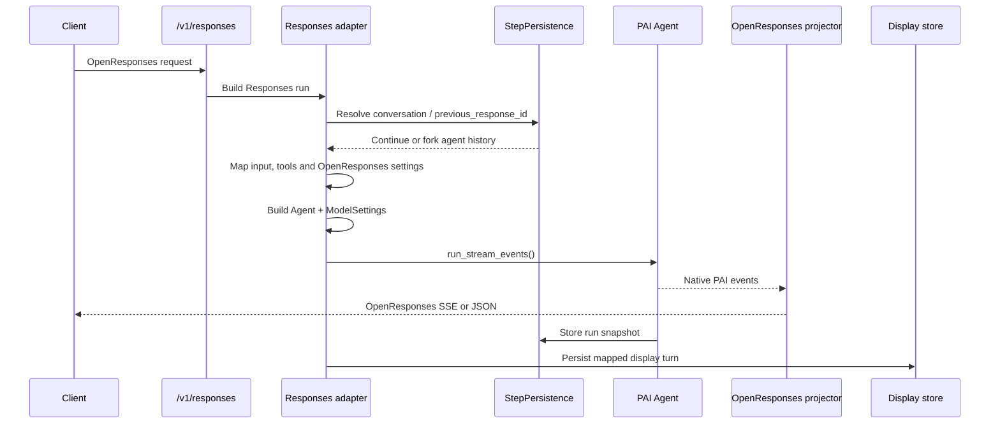
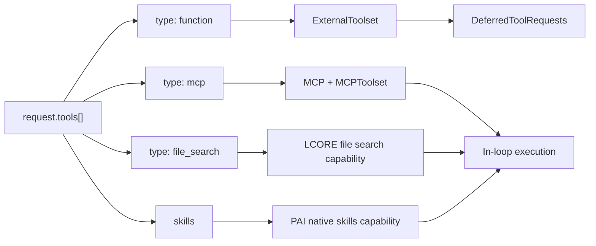
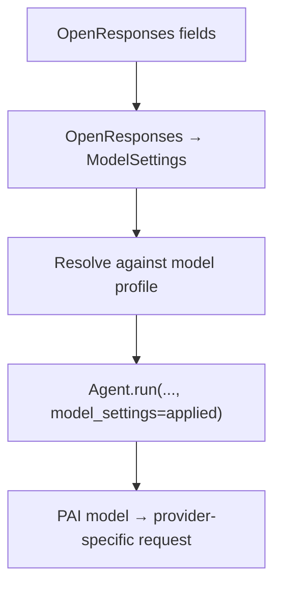

# PAI migration — Responses API

|                          |                                                                                   |
|--------------------------|-----------------------------------------------------------------------------------|
| **Date**                 | 2026-10-08                                                                        |
| **Component**            | lightspeed-stack                                                                  |
| **Authors**              | Andrej Šimurka                                                                    |
| **Feature / Initiative** | [UIESTRAT-216](https://redhat.atlassian.net/browse/UIESTRAT-216)                  |
| **Spike**                | [LCORE-4290](https://redhat.atlassian.net/browse/LCORE-4290)                      |
| **Links**                | Investigation: `docs/devel_doc/pai-responses-lcore-rewrite.html`                  |

This document is the architecture for LCORE’s OpenAI-compatible Responses API after OGX removal. It records the chosen design and the reasoning behind it; it is not an implementation specification.

The Responses HTTP adapter is the subject here: how a `/v1/responses` request becomes a pydantic-ai `Agent` run, how tools keep today’s execution split, and how PAI results are projected into the OpenResponses envelope. Sibling notes cover the provider registry, stored prompts, tools/MCP/file_search, the display conversation, compaction, and streaming interrupt; this document consumes those designs rather than restating them.

---

## 1. Overview

`POST /v1/responses` is LCORE’s OpenAI-compatible Responses surface. Clients send an OpenResponses request — `input`, optional `instructions` or stored `prompt`, `tools`, `previous_response_id`, sampling knobs, `text.format` — and receive either a completed Responses JSON object or an OpenResponses SSE stream.

Today, the endpoint is largely an OGX pass-through. LCORE authenticates the request, applies quota, prepares tools, and then calls `client.responses.create`. OGX owns the model loop, tool execution, conversation chaining, and the Responses object returned to LCORE.

After OGX removal, LCORE can no longer forward the request body to a Responses-shaped backend and rely on the backend to provide the same product behavior. The migration therefore keeps the **public HTTP contract** while replacing the OGX call with a **per-request PAI `Agent`**.

LCORE becomes the adapter around that agent:

* Parse the OpenResponses request into agent arguments.
* Run the agent.
* Project PAI events into the LCORE Responses envelope.

Query and streaming query use the same PAI agent execution model. Each API retains its own request handling and response projector. `/v1/responses` emits the OpenAI Responses object or SSE, while streaming query emits LCORE query SSE.

The migration must also preserve two product behaviors currently provided by the OGX pass-through:

* Request `function` tools **break the loop**. The response contains a `function_call`; the external agent executes the tool and resumes with `function_call_output`.
* Request and configured `mcp` and `file_search` tools **execute in-process**. The client receives `mcp_call` and `file_search_call` items with their results already populated.

---

## 2. Background

This section establishes the baseline. It describes how OGX handles `/v1/responses` today, what PAI provides instead, where the two differ, and how LCORE closes the remaining gap.

### 2.1 What OGX Does Today

OGX is the Responses engine behind `/v1/responses`. LCORE forwards an OpenResponses-shaped body to `client.responses.create`; OGX runs the turn and returns the Responses object or OpenResponses SSE. The public envelope clients see today is therefore produced by OGX.

OGX owns the inference loop for the request. It resolves the model, applies instructions and sampling settings, streams model output, and executes tools according to their OpenResponses types:

| OpenResponses `tools[]` entry        | Who executes                          | Public result                                               |
| ------------------------------------ | ------------------------------------- | ----------------------------------------------------------- |
| `type: "function"` from the request  | External agent — OGX breaks the loop  | `function_call`; next request brings `function_call_output` |
| `type: "mcp"` from request or config | OGX connects to `server_url` and runs | `mcp_call` / `mcp_list_tools` with output                   |
| `type: "file_search"`                | OGX                                   | `file_search_call`                                          |

OGX also owns the conversation state used for inference. A request can continue an existing inference context either through `previous_response_id` or through the `conversation` attribute. With `previous_response_id`, OGX continues from the referenced response; with `conversation`, OGX loads the conversation's stored history and continues from it. A stored `prompt.id` is expanded by OGX at request time; ownership of that catalog after cutover is covered in the [Prompts API](pai-prompts-api-migration.md).

Input and output moderation are already LCORE-owned (`run_shield_moderation_v2`). They are not part of the OGX Responses path, but they are also not part of the agent loop: Responses currently runs them through a separate pre-generation interface before calling OGX.

The following summarizes the responsibilities OGX currently owns on this path:

* **Responses execution** — `responses.create` for both JSON and SSE.
* **Model loop** — provider call, streaming parts, and completion of the Responses object.
* **Tool loop** — defer request `function` tools; execute `mcp` and `file_search` in the backend.
* **Conversation chaining** — continuing inference context through either `previous_response_id` or `conversation`.
* **Stored prompts** — resolving `prompt.id`, version, and variables into instruction text.
* **Settings honor** — applying OpenResponses settings, including `text`, on the OGX Responses path.

Because OGX owns the inference context, LCORE cannot compact a conversation and then hand the same conversation back unchanged: OGX would reload the full history. Compaction therefore currently uses `omit_conversation` and reconstructs the model input itself; the post-cutover design is covered in [conversation compaction](pai-compaction-migration.md).

### 2.2 What PAI will do instead

PAI becomes the library that runs the agent behind `/v1/responses`. For each request, LCORE creates an `Agent` with the selected model, instructions, tools and capabilities, and output configuration. **OpenResponses request settings are mapped by LCORE to the corresponding PAI `ModelSettings` and agent configuration before the run starts.** `Agent.run` / `run_stream_events` then owns the model call and the agent loop, including any in-loop tool execution.

For tools, PAI already provides the primitives needed to preserve the distinction between deferred client tools and locally executed tools:

* **Deferred client tools.** `ExternalToolset` combined with an `output_type` that includes `DeferredToolRequests` ends the run when the model requests a client-side function. A subsequent request can resume the run with `deferred_tool_results`.
* **Local tools.** `MCP(native=False, local=MCPToolset(...))` executes MCP tools in-process. File search and skills are attached as LCORE tools or capabilities.

For history, PAI's `StepPersistence` stores agent-history snapshots. **Its `continue_run` function provides the basis for `conversation` continuation, while its `fork_run` function provides the basis for `previous_response_id` continuation.** LCORE maps its public conversation and response identifiers onto these PAI history mechanisms; PAI itself does not define LCORE's `conversation_id` or response identities.

For settings, PAI provides `ModelSettings` as the common interface for model-generation settings. **LCORE translates OpenResponses attributes into `ModelSettings`, while the model profile is used to resolve how those settings should be applied based on the capabilities of the selected model.** PAI then handles the provider-specific translation of supported settings into the names and formats expected by the underlying provider.

For streaming, PAI emits native agent-run events. **LCORE implements a Responses-specific event stream on top of PAI's `UIEventStream` mechanism, transforming those native events into OpenResponses-compatible events.** The same agent run can therefore be projected into the Responses format without changing the underlying agent execution.

### 2.3 Responsibilities After the Migration

**What PAI takes over.** PAI takes over the model call, in-loop tool execution, agent streaming events, agent-history snapshots, profile-aware `ModelSettings`, cooperative cancellation, and structured output through `output_type`.

**Benefit of using PAI.** LCORE no longer forwards `/v1/responses` through OGX `responses.create`. One agent loop can serve Responses and query / streaming query; only the projector differs. Tool deferral, local MCP execution, history continuation and forking, model profiles, and provider-specific settings translation become PAI-backed mechanisms rather than OGX Responses pass-through behavior.

**Gap LCORE must close.** PAI provides the agent execution layer, but it does not provide the LCORE Responses API. It does not accept OpenResponses JSON, resolve LCORE's `conversation` / `previous_response_id` semantics, apply the OpenResponses tool split, translate the full Responses request into agent and model settings, or produce the Responses object and OpenResponses event format. Stored-prompt resolution currently done by OGX is covered in the Prompts API.

Existing LCORE product behavior around the agent call remains LCORE-owned: authentication, quota handling, request sanitization, telemetry, tool-merge policy, client-versus-server output filtering, display persistence, and shields. Shields move from the separate pre-generation interface onto `wrap_run` capabilities on the shared agent path.

LCORE closes the remaining gap with a **Responses adapter** around the shared PAI agent loop. It maps OpenResponses requests to agent and model configuration, resolves conversation and response continuation, wires tools according to the existing execution semantics, applies LCORE-specific behavior and identifiers, and projects PAI events into the LCORE Responses envelope. `/v1/responses` therefore remains an LCORE API backed by PAI; it does not expose raw PAI objects as its public response.

---

## 3. Final design at a glance

A Responses request still begins with LCORE product steps: auth, quota, conversation load, and sanitization. The **Responses adapter** then resolves instructions and the model, assembles tools, maps OpenResponses fields to `ModelSettings` and agent configuration, resolves conversation continuation, and builds an `Agent` with shield capabilities and [tiered compaction](pai-compaction-migration.md). The agent runs through `run_stream_events`. The OpenResponses projector transforms the native PAI events into either an SSE stream or a buffered Responses JSON body. Display persistence remains a separate write through the conversations mapper.

Query and streaming query share the same agent-building and execution path. They consume the same native PAI events but transform them into their respective API response formats rather than the OpenResponses format.



The remaining pieces are provided by shared LCORE infrastructure rather than by the Responses adapter itself. The provider registry supplies the selected model and its profile; prompt resolution produces runtime instructions; tool registration provides MCP, file search, and skills; the Conversations API maps agent history to the LCORE display model; conversation compaction manages the agent-facing history; and streaming interrupt provides cancellation. These pieces are shared building blocks that the Responses adapter assembles into a run. The same agent execution, persistence, compaction, and cancellation mechanisms can therefore be reused by the Responses and query paths, while each path keeps its own API-specific request and response handling.

---

## 4. Detailed design

### 4.1 Public contract

The client-visible Responses contract does not change. Clients continue to POST OpenResponses compatible request bodies to `/v1/responses`, optionally with `stream: true`. They continue to receive the same response identifiers, output item types, and HTTP error behavior.

The important change is **who produces that contract**. After the migration, LCORE produces the Responses envelope from the PAI agent run rather than forwarding the request to OGX.

The FastAPI endpoint remains responsible for the product-level concerns that happen before and around the run: authorization, quota, request sanitization, and telemetry. The endpoint handler itself becomes thin; it hands the request to the Responses adapter, which builds and executes the agent run and projects the result back into the Responses contract.

### 4.2 Shared agent loop

The agent is built once per request from the resolved model, instructions, tools and capabilities, output type, history, and LCORE-generated identifiers. Both `stream=true` and `stream=false` use `run_stream_events`.

There is therefore no separate `Agent.run` path for non-streaming responses. The same native event stream is consumed by the OpenResponses projector:

```python
agent = build_agent(
    model,
    instructions,
    toolsets,
    capabilities,
    output_type,
)

async with agent.run_stream_events(
    prompt,
    message_history=history,
    conversation_id=conversation_id,
    run_id=run_id,
    model_settings=applied_settings,
    deferred_tool_results=deferred,
) as native:

    events = projector.transform_stream(native)

    if stream:
        async for chunk in projector.encode_stream(events):
            yield chunk
    else:
        async for _ in events:
            pass

        return projector.final_response
```

This keeps the execution path identical for both HTTP modes. The only difference is whether the projected events are sent immediately as SSE or accumulated into the final Responses object.

Query and streaming query use the same agent-building and `run_stream_events` path. They provide their own projectors for their respective response formats. Cooperative cancel of that shared loop is [streaming interrupt](pai-stream-interrupt-migration.md).

### 4.3 Shields as agent capabilities

Input and output moderation remain LCORE-owned. Today, Responses runs moderation through a separate pre-generation interface before calling OGX. After the migration, shields are attached to the shared agent run as `wrap_run` capabilities, same as in query endpoints.

This keeps moderation inside the same execution path as the model call and allows the same shield behavior to be reused by other agentic endpoints. Shields remain outermost so a refusal prevents the model loop from starting or continuing.

A shield refusal remains a **completed Responses result**, or a stream that ends with `response.completed` containing the refusal. It is not an HTTP 4xx response and does not use a separate shield-specific SSE generator.

### 4.4 Tool execution

Tool registration owns how MCP servers, file search, and skills are attached. The Responses adapter is responsible for preserving the public execution semantics of the existing Responses API: **which OpenResponses tool types are executed by LCORE and which are deferred to the client**. See [tools, MCP, and file_search](pai-tools-mcp-filesearch-summary.md) for how those in-loop tools are registered.



A request `function` tool becomes an `ExternalToolset`. When such tools are present, the agent's `output_type` includes `DeferredToolRequests`. If the model requests one of these functions, the run ends with deferred tool requests that LCORE projects as `function_call` output items.

A request `mcp` tool is different. It is attached as an in-process `MCP(native=False, local=MCPToolset(...))`, just like configuration MCP. It therefore executes inside the agent loop. Placing request MCP tools on `ExternalToolset` would change the existing contract by turning them into client-executed functions.

The existing LCORE policies remain before the agent runs: server/client tool merging, allowed-tool filtering, `tool_choice=none`, and conflict validation. Once the effective tools have been assembled, `tool_choice` is translated to PAI's tool preparation mechanism using the selected model's profile. Backend-specific branching is not required in the Responses adapter.

The existing client/server output filtering also remains a product rule. When server-tool merging is enabled, server MCP output is hidden from the client stream while client-visible function calls and applicable MCP output remain exposed. The same filtering is applied to the turn summary, metrics, and display persistence.

### 4.5 External function-call continuation

The wire contract for client-executed functions remains unchanged.

When a response contains a `function_call`, the client executes the function and sends a subsequent request containing the corresponding `function_call_output` with previous context identifier or explicit items list:

```json
{
  "previous_response_id": "<prior response id>",
  "input": [
    {
      "type": "function_call_output",
      "call_id": "fc_1",
      "output": "…"
    }
  ],
  "tools": []
}
```

The Responses adapter resolves the referenced agent history, creates a new run, and converts the returned function outputs into PAI `DeferredToolResults`. This allows the next PAI run to continue the deferred tool interaction.

MCP tools that execute in-process do not use this continuation mechanism because their execution remains inside the original agent run.

### 4.6 Conversation and response continuation

The Responses API exposes two continuation concepts: `conversation` and `previous_response_id`. The adapter maps these onto PAI's persisted agent history. Display identity and the `/v3` transcript for the same `conversation_id` are the [two-store split](pai-conversations-api-redesign.md#41-two-stores-one-conversation_id); shrinking that agent history is conversation compaction.

For `previous_response_id`, the adapter applies the existing **tip-versus-fork** policy:

* If the referenced response is the last response of its conversation, use `StepPersistence.continue_run` and keep the existing conversation.
* If it refers to an earlier response, use `StepPersistence.fork_run` and create a new conversation from that point.
* In both cases, LCORE mints a new `run_id`; the public `response.id` is that new run identifier.

`continue_run` and `fork_run` load agent messages; they do not assign LCORE conversation or response identities. The adapter therefore supplies the appropriate `conversation_id` and `run_id` explicitly when starting the PAI run.

Conceptually:

```python
if is_tip:
    history = await continue_run(store, run_id=previous_response_id)
    conversation_id = existing_conversation_id
else:
    history = await fork_run(store, run_id=previous_response_id)
    conversation_id = str(uuid4())

run_id = "resp_" + str(uuid4())

await agent.run_stream_events(
    prompt,
    message_history=history,
    conversation_id=conversation_id,
    run_id=run_id,
)
```

Forking must use an explicit new `conversation_id`. Omitting it would allow the PAI run to inherit the parent thread. Conversely, forking every `previous_response_id` would incorrectly create a new conversation for normal linear continuation.

The `conversation` request attribute resolves to the existing conversation and its agent history, providing the equivalent of `continue_run` for the conversation-based continuation path.

### 4.7 OpenResponses settings → `ModelSettings`

OpenResponses model-generation fields are translated through **one LCORE OpenResponses → `ModelSettings` mapping**. The adapter does not maintain separate translators for common settings for each inference provider. After the map, the [provider registry](pai-providers-registry.md) profile decides which knobs the selected model can honor.

The flow is:



The selected model's profile determines which requested settings it can honor. Unsupported settings can therefore be dropped with warnings according to the provider/profile policy. PAI's model implementation then translates the supported `ModelSettings` into the names and formats required by the underlying provider.

This gives the Responses path three layers of translation:

1. **OpenResponses → PAI `ModelSettings`** — owned by LCORE.
2. **Profile resolution** — determines what the selected model can honor.
3. **PAI model → provider wire format** — handled by the PAI model implementation.

Settings such as `temperature`, `top_p`, penalties, and `max_output_tokens` therefore become PAI-native settings rather than being forwarded as an opaque request body. Provider-specific or Responses-specific settings are represented only where PAI and the selected model support them.

`tools`, `tool_choice`, `input`, `conversation`, `previous_response_id`, and `text.format` are not generic `ModelSettings`; they are mapped to the corresponding agent, history, or output configuration.

### 4.8 Structured output: `text.format` → `output_type`

`text.format` controls the agent's output contract rather than the model settings.

For normal text, the agent uses `output_type=str`. When client function tools are present, `DeferredToolRequests` is included in the output type so a function call can terminate the run.

For `json_object` and `json_schema`, the adapter constructs the PAI structured output type from the request's runtime `text.format` using `StructuredDict`. This output type is then supplied to the agent for that request. The selected model profile determines which PAI output mode can enforce the contract:

* native structured output when the model supports it;
* tool-based structured output where supported;
* prompted structured output as a fallback.

An invalid or incomplete client schema is a cannot-start error. A model that cannot satisfy the requested output contract through any supported mode is also rejected before the run starts.

The public Responses shape remains unchanged. Structured results are serialized into the existing `output_text` item rather than introducing a new Responses item type. Deferred client function calls still take precedence and are projected as `function_call` items.

OpenResponses `text` shape:

```json id="vx6ghz"
{
  "text": {
    "format": {
      "type": "text" | "json_object" | "json_schema",
      "name": "…",
      "description": "…",
      "schema": {},
      "strict": true
    },
    "verbosity": "low" | "medium" | "high"
  }
}
```

For structured output, the runtime `format` is converted into a `StructuredDict` and used as the agent's `output_type`. The resulting structured type is then wrapped in the output mode selected for the model profile:

```python id="t7p1dy"
# json_object — free-form object
StructuredDict(
    {"type": "object", "additionalProperties": True},
    name="json_object",
)

# json_schema — client-provided schema
StructuredDict(
    format.schema,
    name=format.name,
    description=format.description,
)
```

### 4.9 Responses input adapter

The Responses adapter is the boundary between the OpenResponses request model and the PAI run model. Its job is not to execute the agent itself, but to resolve the request into the arguments and objects required by the shared agent loop.

The main mappings are:

| OpenResponses input             | PAI / LCORE representation                                       |
| ------------------------------- | ---------------------------------------------------------------- |
| `model`                         | provider registry → PAI model                                    |
| `input`                         | agent prompt / input items                                       |
| `function_call_output`          | `DeferredToolResults`                                            |
| `instructions`                  | runtime agent instructions (Prompts API when `prompt` is set)    |
| `tools`                         | PAI toolsets / capabilities                                      |
| sampling and reasoning settings | `ModelSettings` + profile resolution                             |
| `text.format`                   | agent `output_type`                                              |
| `conversation`                  | conversation / agent history continuation                        |
| `previous_response_id`          | `continue_run` / `fork_run` ([§4.6](#46-conversation-and-response-continuation)) |
| `store`                         | include / exclude `StepPersistence`                              |
| `stream`                        | SSE vs buffered projection; agent still uses `run_stream_events` |

Request sanitization remains on the API boundary, including secret removal from echoed fields and request size limits.

### 4.10 Responses output projector

The output side is the inverse boundary: PAI emits native agent events, and LCORE transforms them into OpenResponses events.

LCORE implements this as an `OpenResponsesEventStream` on top of PAI's `UIEventStream` mechanism. The stream class is responsible only for transforming events; the Responses adapter continues to build the agent and supply its run arguments.

At implementation level, `UIEventStream` provides the standard event-dispatching methods. `OpenResponsesEventStream` specializes its event type to OpenResponses stream events and **overrides the relevant `handle_*` methods** to map PAI inputs onto those objects:

```python
class OpenResponsesEventStream(UIEventStream[..., OpenResponsesStreamEvent, ...]):
    async def before_stream(self):
        yield ResponseCreatedEvent(...)       # response.created
        yield ResponseInProgressEvent(...)    # response.in_progress

    async def handle_text_delta(self, delta: TextPartDelta):
        yield ResponseOutputTextDeltaEvent(...)  # response.output_text.delta

    async def handle_function_tool_call(self, event: FunctionToolCallEvent):
        # executed in-loop tool → mcp_call / file_search_call item events
        yield ResponseOutputItemAddedEvent(...)
        yield ResponseOutputItemDoneEvent(...)

    async def handle_deferred_tool_requests(self, event: DeferredToolRequestsEvent):
        # deferred client tool → function_call item events
        yield ResponseOutputItemAddedEvent(...)
        yield ResponseOutputItemDoneEvent(...)

    async def handle_run_result(self, event: AgentRunResultEvent):
        yield ResponseCompletedEvent(...)     # response.completed

    async def on_error(self, error: Exception):
        yield ResponseFailedEvent(...)        # response.failed
```

The exact set of overrides follows the PAI event types that are relevant to the Responses API. The projector may then encode those OpenResponses events as SSE for a streaming response.

The important architectural point is that **the projector changes the representation of the run, not the execution of the run**. The agent does not know whether its events will be returned through `/v1/responses`, `/v1/query`, or another API.

For `stream=false`, the same event stream is consumed without flushing events to the client. The projector maintains the resulting Responses representation and returns it once the run completes. This avoids maintaining a second result-to-JSON implementation that could diverge from streaming behavior.

The mapping includes:

| PAI event                           | Responses representation                            |
| ----------------------------------- | --------------------------------------------------- |
| stream start                        | `response.created`                                  |
| text start / delta / end            | output item and `response.output_text.*` events     |
| deferred function call              | `function_call` output item                         |
| executed MCP / file-search activity | corresponding `mcp_call` / `file_search_call` items |
| run result                          | `response.completed`                                |
| run error                           | `response.failed`                                   |

The existing client/server output filtering is applied while events are projected.

### 4.11 Error and completion behavior

The migration preserves the distinction between errors that prevent a run from starting and outcomes produced by a run.

* **Validation / cannot-start / output-contract errors** return HTTP 4xx before the agent runs.
* **Authentication and quota failures** retain their existing HTTP behavior.
* **Provider failures** failures that occur after the agent run has started are represented as `response.failed`, while request validation, authentication, quota, and other pre-run failures retain their existing HTTP behavior.
* **Shield refusals** produce a completed Responses result containing the refusal.
* **Mid-run model or tool failures** are represented by `response.failed` and persisted as an error outcome.

This keeps the public API behavior independent from whether the underlying execution engine is OGX or PAI.

### 4.12 Alternative designs

Several alternatives were considered and rejected.

**Treat every request tool as deferred.** This would turn request MCP into client-executed function calls and change the current product semantics. Only `function` tools are deferred.

**Use `Agent.to_responses()` as the endpoint.** The endpoint needs LCORE-specific item shapes, tool visibility, filtering, and continuation semantics. The `UIEventStream` projector gives LCORE control over the public Responses representation while reusing PAI's event model.

**Maintain separate streaming and non-streaming execution paths.** Both modes use `run_stream_events`; non-streaming simply buffers the projected events. This keeps the two public response modes consistent.

### 4.13 What is removed

After the cutover, the following OGX-specific mechanisms leave the `/v1/responses` execution path:

* OGX `responses.create` and its Responses stream.
* The separate pre-run OGX shield interface and `shield_violation_generator`.
* Compaction through `omit_conversation`.
* Forwarding stored `prompt.id` to OGX.
* OGX ownership of `previous_response_id` continuation.
* Forwarding `text` and other Responses fields through `extra_body`.
* OGX-specific Responses model helpers once the provider registry supplies the PAI model directly.

The FastAPI surface remains responsible for authentication, quota, sanitization, telemetry, tool-merge policy, the client/server output filter, and the public OpenResponses contract. The execution logic moves into the shared agent loop, while the Responses-specific translation remains concentrated in the input adapter, continuation logic, and `OpenResponsesEventStream`.
