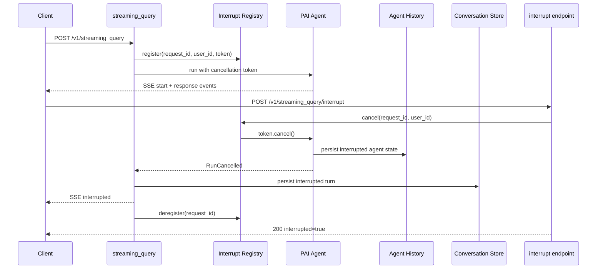
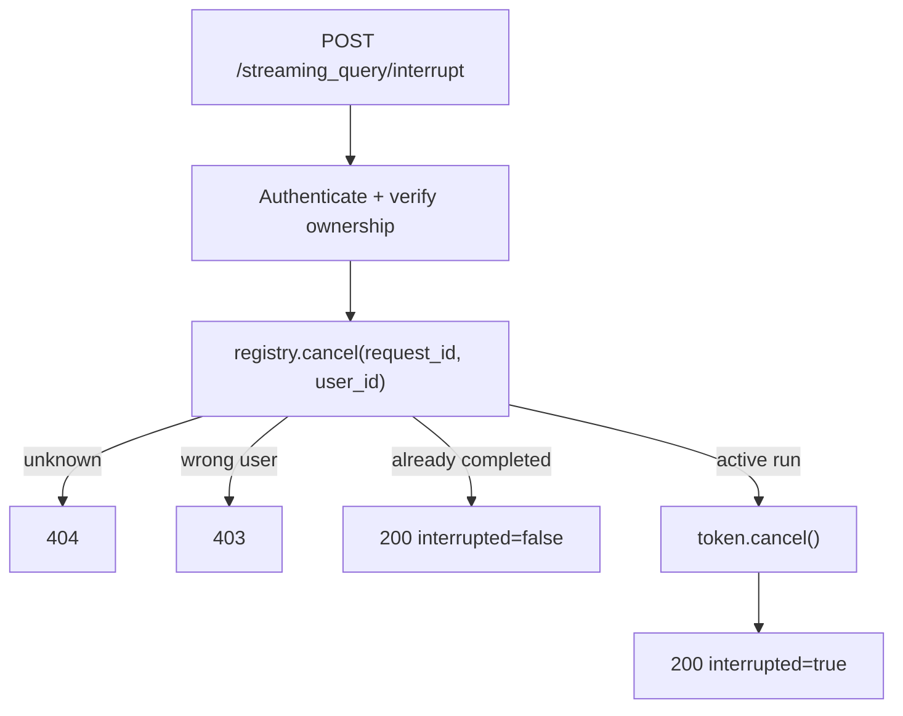

# PAI migration — streaming query interrupt

|                          |                                                                                   |
|--------------------------|-----------------------------------------------------------------------------------|
| **Date**                 | 2026-10-08                                                                        |
| **Component**            | lightspeed-stack                                                                  |
| **Authors**              | Andrej Šimurka                                                                    |
| **Feature / Initiative** | [UIESTRAT-216](https://redhat.atlassian.net/browse/UIESTRAT-216)                  |
| **Spike**                | [LCORE-4290](https://redhat.atlassian.net/browse/LCORE-4290)                      |
| **Links**                | Investigation: `docs/devel_doc/pai-stream-interrupt-migration.html`               |

This document is the architecture for LCORE’s streaming query interrupt after OGX removal. It records the chosen design and the reasoning behind it; it is not an implementation specification.

---

## 1. Overview

LCORE allows a user to stop an in-progress streaming response before the agent has finished. When the user interrupts a stream, the response is finalized as an **interrupted turn**: the partial response generated before the interruption is preserved, the conversation records the interrupted turn, and the client is notified that the stream has ended.

The interrupt is initiated through a separate request. The client identifies the stream it wants to stop using its `request_id`, and LCORE verifies that the stream belongs to the requesting user before signalling the active streaming request to stop. The streaming flow then handles the interruption by finalizing the partial response, persisting the interrupted turn, sending the remaining response suffix if needed, and ending the stream with an `interrupted` event.

Today, stopping the stream is implemented by cancelling the asynchronous task responsible for the streaming request. This means the interruption is handled as part of the stream task's cancellation flow, where LCORE must recover the partial response and ensure that the interrupted turn is persisted before the stream is finalized.

As part of the migration from OGX to PydanticAI (PAI), this mechanism changes. Rather than cancelling the task that owns the stream, LCORE will signal the running agent to stop through PAI's cancellation mechanism. The agent can then cooperatively stop its current work while the streaming request remains responsible for completing the user-facing interruption flow.

The **client-facing behavior remains unchanged**. Clients continue to identify an active stream using its `request_id`, the interrupt endpoint continues to report whether an active stream was interrupted, and the stream continues to finish with an `interrupted` event. The migration changes how the running agent is stopped internally, rather than changing the interrupt contract. The same cancellation token can later be attached to the Responses API stream.

The migration also preserves the separation between the **display conversation** and the **agent's internal history** ([Conversations API](pai-conversations-api-redesign.md#41-two-stores-one-conversation_id)). LCORE remains responsible for recording the interrupted response presented to the user, while the PAI agent infrastructure manages the agent-facing state required to continue or reason about the conversation. [Conversation compaction](pai-compaction-migration.md) continues to rewrite only that agent history.

---

## 2. Background

This section establishes the baseline. It describes how LCORE interrupts a streaming query today, what PAI provides instead, where the two differ, and how LCORE closes the remaining gap.

### 2.1 What LCORE does today

Today, interrupting a streaming query means cancelling the asynchronous task that owns the HTTP stream. When a streaming request starts, LCORE registers an `ActiveStream` in `StreamInterruptRegistry` under the `request_id`: the asyncio task, the owning `user_id`, an optional `on_interrupt` persist callback, and the `conversation_id` used for observability. The interrupt endpoint authenticates the caller, verifies ownership, looks up that entry by `request_id`, and cancels the task. Because the registry holds the task itself as the handle for interruption, cancelling the whole request task makes the rest of the interruption flow more complex.

Cancellation can happen at different stages of the request. If it happens while LCORE is generating the response, LCORE can handle the interruption directly and finish the response with the `interrupted` event. If it happens while LCORE is already sending data to the client, the cancellation may bypass that handling, so a separate fallback path is needed to persist the interrupted turn. Today, both paths use a shared guard to ensure that the turn is persisted only once.

Because the HTTP task itself is cancelled, LCORE must also clear the cancellation state before it can finish the interruption flow. It reconstructs the accumulated token deltas, repairs open markdown, appends the interruption indicator, and emits the `interrupted` SSE event.

Usage is currently recorded only when the request completes normally. An interrupted stream therefore does not consume usage.

The public interrupt contract is independent of these implementation details:

| Request                                  | Outcome                       |
| ---------------------------------------- | ----------------------------- |
| `{ "request_id": "…" }` from SSE `start` | 200 `interrupted=true\|false` |
| Unknown `request_id`                     | 404                           |
| Request owned by another user            | 403                           |

When an active stream is interrupted, LCORE persists the partial response as an interrupted conversation turn and terminates the stream with an `interrupted` event.

This design also reflects the OGX-era conversation model. The same conversation store represents both what the user sees and the context used for subsequent inference. There is therefore no separate agent-history snapshot to preserve: persisting the interrupted turn serves both purposes.

### 2.2 What PAI provides instead

PAI separates stopping an agent run from cancelling the request that is serving it. For a user-initiated stop, PAI provides a `CancellationToken` that is created for the run and passed to the agent. Another request or task can then cancel that token while the streaming request continues to run.

When the token is cancelled, PAI cooperatively stops only the **agent run**, not the HTTP request serving the stream. The in-flight model request is stopped and in-flight tool work is cancelled and drained, while the HTTP request itself remains active and can complete its own interruption flow. The cancelled run raises `RunCancelled` instead of returning a normal result, but its message history preserves the work completed before cancellation, including any partial streamed response. It also provides usage, `run_id`, and `conversation_id` for LCORE to use when finalizing the interrupted request.

PAI recommends `CancellationToken` when an agent run needs to be cancelled from outside the agentic loop. LCORE creates the token when starting the run and can later cancel it from the separate interrupt request using the `request_id` associated with that run.

PAI also separates agent history from the display conversation. Its cancellation handling records the interrupted response in the run's message history, while `StepPersistence` can persist the agent-facing state for later continuation. LCORE therefore does not need to recreate the agent's interrupted history as part of its interrupt handling.

PAI does not provide the product-level interrupt contract. It does not know about LCORE's `request_id`, request ownership, display transcript, markdown presentation, or SSE event format.

### 2.3 Responsibilities After the Migration

The migration therefore moves **stopping the agent run** to PAI while keeping **handling the user-facing interruption** in LCORE.

**PAI takes over run cancellation.** PAI owns the cooperative teardown of the agent run and reports the result through `RunCancelled`. `StepPersistence` owns the corresponding agent-history snapshot.

**LCORE keeps the interrupt contract.** LCORE continues to expose the interrupt endpoint, authenticate the caller, verify ownership, and map the client's `request_id` to the active run.

**LCORE keeps the display flow.** The streaming request remains responsible for turning the cancelled run state into the response shown to the user. This includes reconstructing the partial display text, repairing open markdown, persisting the interrupted display turn, and emitting the `interrupted` SSE event. Because the HTTP request itself is not cancelled, this flow can complete normally after PAI stops the agent.

The integration is therefore straightforward: LCORE creates a `CancellationToken` for each streaming run and stores it in the existing interrupt registry. When the interrupt endpoint receives a `request_id`, it verifies ownership and cancels the corresponding token. PAI stops the agent and raises `RunCancelled`, which LCORE handles as the signal to finalize the user-facing response.

---

## 3. Final design at a glance

The design separates the **request that runs the stream** from the **request that stops it**.

When `POST /v1/streaming_query` starts, LCORE creates a `CancellationToken` for the agent run and registers it with the `request_id` and `user_id`. The token is then passed to the agent. If the client later calls `POST /v1/streaming_query/interrupt`, LCORE authenticates the request, verifies ownership, looks up the active run, and cancels its token.

Cancelling the token stops the PAI agent run without cancelling the streaming HTTP request. PAI reports the cancelled run through `RunCancelled`; the streaming request then finalizes the interrupted display response and emits the `interrupted` event. PAI's persistence layer separately records the interrupted agent history.

The registry therefore becomes an index that connects the two HTTP requests: `request_id` → user + cancellation token. It no longer holds an asyncio task or participates in cancelling the HTTP request. The interrupt endpoint remains a thin FastAPI surface with the existing authentication, authorization, telemetry, and response contract; only the mechanism used to stop the active run changes.



* **LCORE** owns the interrupt API, ownership checks, conversation display persistence, markdown repair, interrupted SSE, and usage handling.
* **PAI** owns agent cancellation and reports the cancelled run through `RunCancelled`.
* **PAI persistence** owns the agent-history snapshot created when the run is cancelled.

---

## 4. Detailed design

### 4.1 Public contract

The client-visible interrupt contract does not change. A streaming query still publishes a `request_id` in the SSE `start` event, and the interrupt endpoint still accepts that identifier and returns the same ownership and completion outcomes.

| Surface                                | Behavior                                        |
| -------------------------------------- | ----------------------------------------------- |
| `POST /v1/streaming_query` SSE `start` | Publishes `request_id` and `conversation_id`    |
| `POST /v1/streaming_query/interrupt`   | `{ "request_id": "…" }`                         |
| 200 `interrupted=true`                 | Active stream owned by the caller was cancelled |
| 200 `interrupted=false`                | Stream already completed; nothing to interrupt  |
| 403                                    | Caller does not own the stream                  |
| 404                                    | Unknown `request_id`                            |

The `interrupted` SSE event remains `{ "event": "interrupted", "data": { "request_id": "…" } }`. The display turn continues to include repaired markdown and the interruption indicator. Authorization through `Action.STREAMING_QUERY` is unchanged.

The only client-visible outcome that has a different internal implementation is `interrupted=true`: LCORE now cancels the PAI agent run through its cancellation token instead of cancelling the HTTP task serving the stream.

### 4.2 Cancellation token, not ASGI task cancel

The product interrupt must not cancel the ASGI task serving the SSE response. That task is responsible for continuing the request after the agent stops, finalizing the interrupted turn, and sending the final `interrupted` event. Cancelling the task would bring back the same problems as today: cancellation can bypass the normal handling path, the task has to clear its cancellation state, and interruption may prevent usage from being recorded.

Instead, each streaming run gets a `CancellationToken`. LCORE creates the token when the run starts, registers it with the `request_id` and ownership information, and passes it to the PAI agent. The separate interrupt request uses the `request_id` to find the token and cancel the agent run.

Conceptually, the flow is:

```python
token = CancellationToken()

registry.register(
    request_id,
    user_id=user_id,
    token=token,
)

try:
    async with agent.run_stream_events(
        user_prompt,
        cancellation_token=token,
    ) as stream:
        async for event in stream:
            yield project_sse(event)

except RunCancelled as cancelled:
    await handle_interrupted_run(cancelled)

finally:
    registry.deregister(request_id)
```

The interrupt request does not need access to the `AgentRun` itself. It only needs the `request_id`:

```python
registry.cancel(request_id, user_id)
# → token.cancel()
```

This keeps the responsibilities separated: the interrupt request asks PAI to stop the run, while the streaming request remains responsible for completing the HTTP response. PAI then reports the cancellation through `RunCancelled`, giving the streaming request a normal point at which to finalize the interrupted response.

The same run-building path can provide the cancellation token to other streaming surfaces later, including the [Responses API](pai-responses-lcore-rewrite.md#42-shared-agent-loop) stream. This keeps cancellation as a property of the agent run rather than introducing a separate mechanism for each API.

### 4.3 Registry as ownership index

`StreamInterruptRegistry` continues to connect the two HTTP requests involved in an interrupt. The streaming request registers the active run under its `request_id`, together with the user that owns it and the cancellation token that can stop the run.

The interrupt request uses that entry to authenticate the caller, verify ownership, and request cancellation. The registry no longer needs to hold or cancel the ASGI task itself.



The registry therefore becomes an **ownership and cancellation index**:

`request_id → user + cancellation token`

It does not persist conversation turns, repair display text, or emit SSE events. Those responsibilities remain with the streaming request, which continues to own the response stream after the agent run is cancelled.

### 4.4 Handling `RunCancelled`

`RunCancelled` is the signal that the agent run was stopped by an interrupt. It is not a failed `AgentRunResult`, so LCORE should not wait for a final result or look for an `.output` value. Instead, the cancelled run provides the state needed to complete the user-facing interruption flow.

From `RunCancelled`, LCORE can recover the information needed for the display response and usage accounting:

| Need                             | Source on `RunCancelled`            |
| -------------------------------- | ----------------------------------- |
| Partial assistant text           | `all_messages()` / `new_messages()` |
| Usage from completed model calls | `usage`                             |
| Correlation                      | `run_id`, `conversation_id`         |

The streaming request handles the cancellation in the same place regardless of when the interrupt occurs:

1. Extract the partial assistant text from the cancelled messages.
2. Repair open markdown and append the interruption indicator.
3. Persist the display turn with `status=interrupted`.
4. Record usage from `cancelled.usage`.
5. Finish the visible stream.
6. Deregister the `request_id`.

Finishing the visible stream means sending any remaining text needed to bring the client in sync with the persisted turn, followed by the terminal `interrupted` SSE event. The remaining text may contain markdown repair and the interruption indicator that were not already streamed. For an early cancellation, there may be no model text to send.

This is simpler than the current task-cancellation flow because the HTTP request itself remains active. There is no separate fallback path for cancellation occurring while data is being sent, and no cancellation state that LCORE needs to clear before completing the response.

If the run is cancelled before a model response is produced, there may be no assistant text and no usage to record. This is still a successful interrupt: the client receives the `interrupted` event, while the display turn contains no generated response content.

### 4.5 Two stores on interrupt

The Conversations API and conversation compaction already separate a `conversation_id` into two representations: the **display transcript** and the **agent history** used to build context for the next run. Interrupt follows the same split.

**Agent history.** When the run is cancelled, PAI's `StepPersistence` automatically persists the run as a snapshot with `state="interrupted"`. By default, PAI's continuation logic skips interrupted snapshots when choosing which snapshot to continue from. In other words, if a conversation ends with an interrupted run, the default continuation starts from the last completed snapshot rather than the interrupted one.

That is **not** the behavior LCORE wants. Today, when a streaming turn is interrupted, LCORE explicitly appends that turn to the conversation. A subsequent request therefore sees the interrupted turn as part of the conversation history. We want to preserve that behavior after the migration.

To do this, LCORE's conversation resolver will always use `include_interrupted=True` when resolving a conversation for an agent run. The resolver takes the `conversation_id`, loads the corresponding agent history, and produces the message history passed to the agent. With this flag, that history includes interrupted snapshots as well as completed ones.

The flag is an LCORE policy, not a user choice. It ensures that PAI's default continuation semantics do not silently change the existing LCORE conversation behavior.

**Display store.** The display transcript remains separate. On `RunCancelled`, the streaming request applies markdown repair, persists the interrupted turn (`status=interrupted` on the [Conversations API](pai-conversations-api-redesign.md#44-agentturn) `AgentTurn`), and emits the interrupted SSE event — preserving the current user-visible behavior.

### 4.6 Quota and usage

Today, interrupted streams do not consume usage because cancellation bypasses the normal completion path, so LCORE has no reliable usage information at that point.

After the migration, `RunCancelled.usage` provides usage accumulated before the cancellation. LCORE will charge that usage when model calls completed before the interrupt. A cancellation before any model call completes therefore consumes nothing, while usage from an in-flight call remains best-effort and provider-dependent.

This extends the current behavior: interrupting a stream no longer discards usage for model work that has already been performed.

### 4.7 What is removed

After the PAI cutover, the ASGI-task interrupt machinery described in [§2.1](#21-what-lcore-does-today) is no longer needed. The streaming path removes:

* Registering `asyncio.current_task()` as the interrupt target
* Using `task.cancel()` as the product interrupt mechanism
* Calling `task.uncancel()` to allow the stream to finish after cancellation
* The `on_interrupt` persistence callback and dual-persist guard
* Treating `asyncio.CancelledError` as the product interrupt signal
* Writing agent-facing history from the LCORE interrupt path
* Skipping usage for interrupted runs

The client-facing interrupt contract remains unchanged: the interrupt API, ownership checks, `status=interrupted` display state, markdown repair, and `interrupted` SSE event all remain.

Usage handling is intentionally extended rather than preserved: completed model calls made before cancellation are now accounted for using the usage reported by `RunCancelled`.
