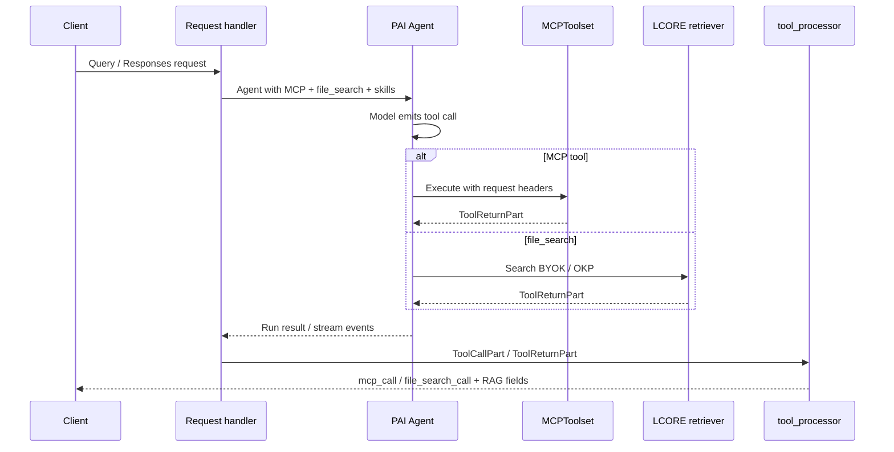

# PAI migration — tools, MCP, file_search

|                          |                                                                                   |
|--------------------------|-----------------------------------------------------------------------------------|
| **Date**                 | 2026-10-08                                                                        |
| **Component**            | lightspeed-stack                                                                  |
| **Authors**              | Andrej Šimurka                                                                    |
| **Feature / Initiative** | [UIESTRAT-216](https://redhat.atlassian.net/browse/UIESTRAT-216)                  |
| **Spike**                | [LCORE-4290](https://redhat.atlassian.net/browse/LCORE-4290)                      |
| **Links**                | Investigation: `docs/devel_doc/pai-tools-mcp-filesearch-summary.html`             |

This document describes the architecture for migrating LCORE's MCP, file_search, and skills from OGX to PAI agent capabilities. It records the chosen design and its rationale.

---

## 1. Overview

Today, LCORE uses OGX as an OpenResponses-compatible provider behind the PAI agent. OGX **presents MCP and file_search as provider-native tools, but their execution is actually handled by OGX itself**, not by the underlying model provider. OGX runs its own tool-execution loop: it intercepts tool calls, executes MCP and file_search, feeds the results back to the model, and continues generation. This abstraction provides a unified tool experience even when the underlying provider does not natively support these capabilities.

After OGX removal, LCORE and PAI must replace OGX's tool-execution loop. All three tool types will execute as function tools within the PAI agent loop, with capabilities and toolsets providing the mechanisms to attach and configure them.

The preferred design is:

* **File search / RAG:** a new LCORE-owned function tool backed by existing retrieval, attached to the agent as a capability.
* **MCP:** PAI's MCP capability with a local `MCPToolset`, executing MCP calls as function tools.
* **Skills:** existing LCORE function tools attached to the agent.

This gives all three a common, provider-independent execution path while keeping retrieval and tool configuration under LCORE's control.

---

## 2. Background

This section establishes the current execution model, the capabilities PAI provides, and the responsibilities that remain with LCORE.

### 2.1 What OGX does today

LCORE uses OGX as an OpenResponses-compatible provider behind PAI. OGX presents MCP and file_search as provider-native tools, giving PAI a unified interface regardless of the underlying model provider's native capabilities.

This is an abstraction: OGX runs its own tool-execution loop, executing MCP and file_search calls, feeding their results back to the model, and continuing generation. This is how LCORE provides a consistent tool experience across supported providers, including those without native MCP or file_search support.

### 2.2 What PAI will do instead

PAI already provides an MCP capability that executes MCP tools within the agent loop. LCORE can use this capability to replace OGX's MCP execution.

File search is different. Although PAI provides a `FileSearchTool`, it relies on provider-native support and provider-managed vector stores. It does not provide the provider-agnostic file_search capability LCORE needs to preserve its existing BYOK / OKP retrieval.

**Implementing an LCORE-owned file_search capability is therefore part of this migration.** It will wrap the existing retrieval implementation as a function tool executed by the PAI agent, keeping retrieval independent of provider-specific file search support.

### 2.3 Responsibilities After the Migration

**PAI responsibilities.** PAI provides the agent loop and MCP capability, and executes the function tools attached to the agent.

**LCORE responsibilities.** LCORE retains MCP server configuration, header construction and authentication, skills, retrieval and corpus configuration, and projection of tool activity into the public API. The migration also adds the missing LCORE file_search capability, backed by existing retrieval.

**Design consequence.** MCP and file_search will use the same agent-executed function-tool path. MCP reuses PAI's existing capability; file_search requires a new LCORE capability. Together, they preserve a consistent experience across supported providers without depending on native MCP or file_search support.

Because function-tool results have a different representation from OGX's provider-native tool results, LCORE must also adapt result processing to preserve the existing typed SSE events, conversation summaries, and RAG-specific fields consumed by the UI.

---

## 3. Final design at a glance

Every supported provider sees MCP, file_search, and skills as ordinary function tools. LCORE builds a fresh agent per request, attaches capabilities and toolsets with that request’s credentials, and runs the PAI loop. Projection of history parts into LCORE SSE / conversation items is a separate mapper.



* **LCORE** owns MCP registry and headers, the file_search retriever, skills, and typed projection.
* **PAI** owns the function-tool loop and local MCP client execution.
* `/v1/responses` still decides which *OpenResponses* `tools[]` entries are deferred client `function` tools versus in-loop MCP. This note is how in-loop MCP / file_search / skills are attached.

---

## 4. Detailed design

### 4.1 MCP and authentication

Use PAI's `MCP` capability with a local `MCPToolset` to execute MCP calls as function tools within the agent loop. Provider-hosted MCP is out of scope.

LCORE already handles MCP server configuration and per-request header merging through `build_mcp_headers`. Preserve this behavior by constructing a fresh capability and toolset for each configured server when building the per-request agent.

```python
toolset = MCPToolset(
    server.url,
    id=f"mcp:{server.name}",
    headers=merged_headers or None,
    include_instructions=True,
    read_timeout=timeout,
)

capability = MCP(
    server.url,
    native=False,
    local=toolset,
    id=f"mcp:{server.name}",
)
```

Use the fully merged headers, including custom and propagated identity headers. Skip servers whose required authentication could not be resolved for the current user. Do not share MCP clients across users; each request must use its own credentials and client instance.

Request-declared MCP tools on `/v1/responses` use the same local execution path.

### 4.2 File search

Implement an LCORE-owned file_search function tool backed by the existing retrieval infrastructure (BYOK / OKP). PAI's native `FileSearchTool` is not the product path: it is not supported by majority of LCORE supported inference providers.

Attach the tool to the agent only when tool-based RAG is enabled, using the same per-request lifecycle as MCP. Keep retrieval filters, authentication, corpus selection, and result handling under LCORE's control.

The specific file_search capability design is out of scope for this feature.

### 4.3 Function tools and skills

Existing skills and other LCORE function tools remain on the PAI agent's function-tool path. Their execution contract does not change as part of OGX removal.

Attach them during per-request agent construction alongside MCP and file_search. Capabilities and toolsets provide the attachment and configuration mechanisms; function tools provide the common execution model.

### 4.4 Tool-result processing

Today, OGX exposes MCP and file_search to PAI as provider-native tools, so their activity appears in history as native tool parts. Removing OGX means attaching these tools directly to the PAI agent and executing them within its function-tool loop. Their calls and results will therefore appear as ordinary `ToolCallPart` / `ToolReturnPart`, rather than native tool parts.

The existing `tool_processor` distinguishes these representations:

| History parts                                 | Current projection                                                                         |
| --------------------------------------------- | ------------------------------------------------------------------------------------------ |
| `NativeToolCallPart` / `NativeToolReturnPart` | Typed `mcp_call`, `mcp_list_tools`, and `file_search_call` summaries, including RAG fields |
| `ToolCallPart` / `ToolReturnPart`             | Generic `function_call` / `function_call_output` summaries                                 |

Extend the function-tool summarization path to recognize the LCORE tool names and result schemas, preserving the existing typed SSE events, conversation summaries, and RAG-specific fields.

The agent history remains ordinary `ToolCallPart` / `ToolReturnPart`; only the LCORE projection needs to preserve the existing public representation.

### 4.5 Alternative designs

* **Provider-native file_search:** rejected as the default because support varies by provider and it uses provider-managed corpora rather than LCORE retrieval.
* **Mixed native and LCORE file_search:** rejected because it creates two retrieval contracts and complicates cross-provider parity.
* **Bare `MCPToolset` without the `MCP` capability:** not preferred; use the capability as the standard agent attachment point.
* **Provider-hosted MCP:** out of scope; it would introduce a different execution and authentication path.
* **Shared process-global MCP clients:** rejected because clients must remain isolated by request and user credentials.

### 4.6 What is removed

After cutover, remove OGX-executed MCP and the OGX/provider-native file_search product path, along with the live-path dependency on native tool parts for their projection. Replace `InputToolMCP` objects forwarded to OGX with per-request PAI MCP capabilities and toolsets.

MCP configuration and header merging, BYOK / OKP retrieval, inline RAG, skills, and typed public summaries remain LCORE responsibilities.
